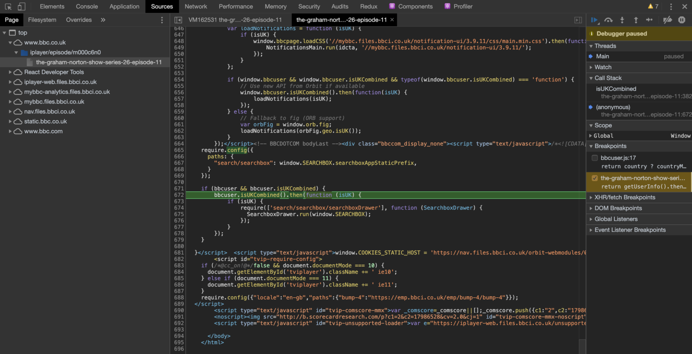
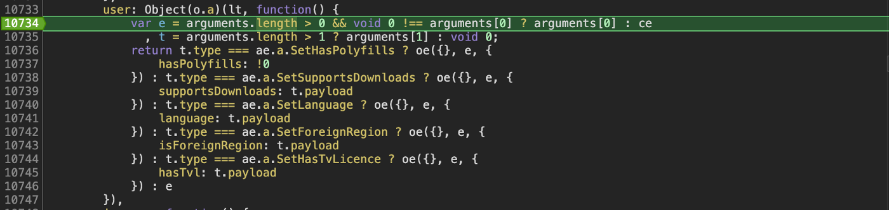
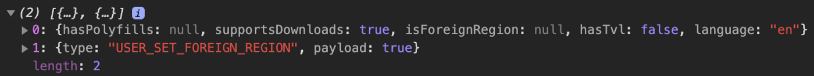

Developing video player in Yandex, I’m not always limited to what we do but also wondering what technologies and techniques are used in other companies. As I like England I investigated the player of BBC, well-known quite a big company. Unfortunately I haven’t used it before, but maybe this is why I’m going to tell you how it’s working.

## Watch the content from non-UK

iPlayer is working only in the UK. After going to [The Graham Norton Show](https://www.bbc.co.uk/programmes/m000cfsk) you’ll see this:

VPN, incognito window or other simple hacks are just not working. Even in 2014 [BBC configured Geolocation technology to manage online content rights](https://www.digitalelement.com/bbc-deploys-digital-elements-ip-geolocation-technology-to-manage-online-content-rights/).

## How BBC identifies you

First of all, to understand how it’s working we need to find where country identification is placed.

If you go to HTML source, you’ll see [inline script](https://gist.github.com/Beraliv/158cc85b53277a332d7298a7563266c4) in it:

Let’s go through it to get a general idea of what is going on here:

1. First, user profile is [initialised](https://gist.github.com/Beraliv/158cc85b53277a332d7298a7563266c4#file-bbcuser-js-L4)

2. Then many auxiliary functions are declared, skip them for now.

3. [User API is declared](https://gist.github.com/Beraliv/158cc85b53277a332d7298a7563266c4#file-bbcuser-js-L97) in `window.bbcuser`, some of the functions use `getUserInfo`

4. `getUserInfo` [checks](https://gist.github.com/Beraliv/158cc85b53277a332d7298a7563266c4#file-bbcuser-js-L71) if data is saved or not:

   - If [saved](https://gist.github.com/Beraliv/158cc85b53277a332d7298a7563266c4#file-bbcuser-js-L76), data is used from the closure
   - If fetch and CORS-requests are allowed, GET-request is initiated from the user profile (for bbc.co.uk it is https://www.bbc.co.uk/userinfo), after first time the response is cached. The response looks like:

     

   - Otherwise, there’s a [fallback function](https://gist.github.com/Beraliv/158cc85b53277a332d7298a7563266c4#file-bbcuser-js-L46) which loads module `orb/fig` with `_figManager.js`. It uses microservice which is available on https://fig.bbc.co.uk/frameworks/fig/2/fig.js and returns a code which is executed later on. The most interest part here is a parameter `uk` — it equals `1` if the request has been sent from the UK, otherwise `0`
   - If the request hasn’t been sent from the UK, watching is prohibited due to rights issues.
   - As I investigated iPlayer from Russia, it returned `0` and the content wasn’t available. The response was:

     

5. At the end of HTML there a script which calls `isUKCombined`, it uses API that I described above, saving my profile to a variable [user](https://gist.github.com/Beraliv/158cc85b53277a332d7298a7563266c4#file-bbcuser-js-L24):

6. Script with `id='tvip-script-app-store'` is inlined in HTML closer to the end of HTML and includes [initial Redux state](https://gist.github.com/Beraliv/f1261bef7701af494fa9b9546032fd5e). You can find the flag [`isForeignRegion`](https://gist.github.com/Beraliv/f1261bef7701af494fa9b9546032fd5e#file-tvip-script-app-store-js-L369) which is `null` by default

7. When `app.bundle.js` is loaded, `componentDidMound` checks that `isUK` is not `0`. As it’s `0`, it calls callback function `onUserForeignRegion`:

8. It updates store value of `isForeignRegion`:

9. It forces `React.component` with possible name `ForeignRegionBanner` to rerender (at least one prop was changed)

10. And finally you can see the warning message on the page
