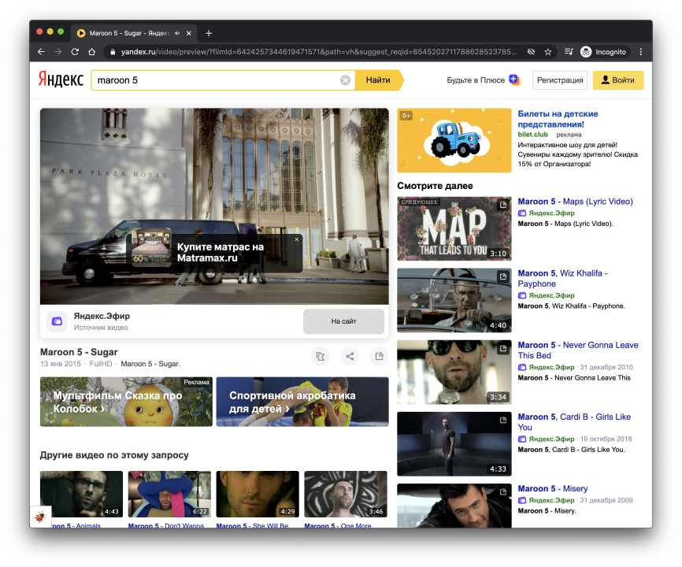

Hey! My name is Alex, and I've spent around 2 years in Yandex, in video player and [video advertising](https://yandex.com/adv/products/video) teams for more than a year in each one.

As the last year is fresh in my memory, I would like to share my experience in video advertising.

## Short introduction

Before the last changes, video player and video advertising player teams work together. After the split, I transferred to video advertising, as at that time I was working on the feature which prevented ad fatigue for several Yandex services.

As I started relatively different and new project, it required adaptation before the start.

## Changes from the last year

In this year we've done a lot. Due to NDA, I cannot share all the interesting parts, however I can mention:

- 💅 Skin redesign using [Preact](https://preactjs.com/) with contexts and hooks and integration of [Storybook](https://storybook.js.org/) for screenshots. It leads to fast and comfortable implementation of the components
- 📦 Usage of different bundles for old and modern browsers in [Webpack](https://webpack.js.org/) with [Babel](https://babeljs.io/) and [Browserslist](https://github.com/browserslist/browserslist). It means we have async, await and generators in production
- 🛠 Usage of OSS and contribution to libraries. It helps us stay up-to-date. Several examples:
  - Needed help in [Browserslist](https://github.com/browserslist/browserslist/issues/489)
  - Created PRs for pleasure in Babel [here](https://github.com/babel/babel/pull/11448) and [there](https://github.com/babel/babel/pull/11468) as started updating it in the project
  - Asked why timeout isn't working in [Nise](https://github.com/sinonjs/nise/issues/160)
  - Created repository [typescript-hacks](https://github.com/Beraliv/typescript-hacks) after the discussion about the interesting parts of Typescript at work - [Invert](https://github.com/Beraliv/typescript-hacks/blob/master/Invert/index.ts)
- 🧪 Tests for every need. Examples:
  - Added screenshots from [Storybook](https://storybook.js.org/) for components using [Hermione](https://github.com/gemini-testing/hermione)
  - Added coverage with [Istanbul](https://istanbul.js.org/)
  - Added smoke tests for production

## Interactions inside the team

The team is indeed highly skilled and professional.

[Kostya Timokhin](https://www.linkedin.com/in/ktimokhin/) was our technical manager until the beginning of this summer. It's especially comfortable working and communicating with him. He's confident in the advertising area, knows the way everything works. We had a lot of common tasks and goals, e.g. preventing ad fatigue.

After Kostya, our technical manager was [Sergey Pavlin](https://www.linkedin.com/in/sergio-pavlin-7725796b/). He's very skilled, managing several advertising teams including ours. He also has [the podcast "After reading..."](https://open.spotify.com/show/0S8k2lWG8rZGLCMPDqEyKN?si=QyusYYu9S1yQ7YemzqGUyw&nd=1) (Russian only). Unfortunately, we were only working on NDA parts, so can't share anything here.

[Max Sysoev](https://www.linkedin.com/in/colch/) - extremely unique frontend developer: knows literally everything, he even developed backend part of our project. Max showed me the world of Typescript. We've found many pitfalls in the codebase. He can share his programming experience in many different ways: it was him who advised to integrate [Google review practices](https://google.github.io/eng-practices/review/reviewer/) and suggested so many changes in Preact components and hooks architecture. The most remarkable task which was done by Max was modern bundles (he even [had a talk about it](https://www.youtube.com/watch?v=CKbOHn1lJWw&t=7841s), Russian only)

[Andrey Senaev](https://www.linkedin.com/in/andrey-senaev-942232137/) - the key developer of the video advertising player team. He was the only one who understood the project in general. I was very comfortable communicating with Andrey as the developer and the team lead. We participated in conferences, did the task for Frontend Contest in 2019 and so many more. The most remarkable task which was done by Andrey was the algorithm for identifying video autoplay ability.

## Conclusion

I worked in the company for a long period of time as it seems to me now. I am very satisfied with what I obtained. I hope I added a lot to the projects as well.

After 2 years of working in video streaming I understood this is what I truly want to do. This industry includes different interesting tasks: from vanilla JS to TypeScript, from small div blocks to component development, from webpack to infrastructure configuration, from array search to the difficult algorithm of choosing the optimal media file and so on and so forth.

Both the projects I worked on and Yandex as a whole showed me that the power of persuasion is not only in person's position within the company but in the arguments presented. It's very inspiring to me and hopefully it will make the world the better place.

If you are interested in job positions, have a look at [Frontend developer in Video advertising](https://yandex.ru/jobs/vacancies/dev/int_dev_video_ad/) (Russian only).

Also, I want to mention the developers of the video player ([Kostya Lekh](https://www.linkedin.com/in/klekh/), [Alex Gusev](https://github.com/mad-gooze), [Anatoly Tenenev](https://github.com/Anatoly-Tenenev), [Sasha Yakovlev](https://www.linkedin.com/in/xescoder/), [Kostya Petryaev](https://www.linkedin.com/in/konstantin-petryaev-65bb52116/) and others), as I really want to thank you all for working together. It was great fun.

See you, Yandex 👋🏻👋🏻👋🏻
