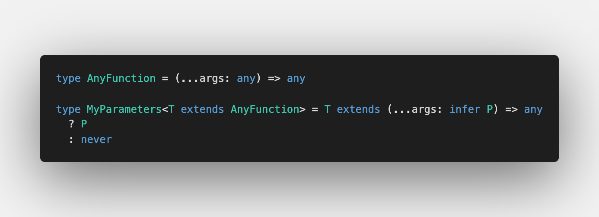

Not a long time ago I revealed [`type-challenges`](https://github.com/type-challenges/type-challenges) for myself. Today I'll show not only the implementation of `Get`, but also the common issues with the implementation, the following improvements and the usage in production.

## Basic implementation

As I said, there's a repo on GitHub: [type-challenges](https://github.com/type-challenges/type-challenges/blob/master/questions/270-hard-typed-get/README.md). The current challenge is located in "hard" category.

Here we can work only with objects (as the solution doesn't require accessing arrays) and also we always can access object keys as they are defined in test cases.

So what should we start from?

### Getting keys

So imagine we solve the same challenge in JavaScript:

```js
const get = (obj, path) => {
  const keys = path.split(".")

  return keys.reduce((currentObj, key) => currentObj[key], obj)
}
```

Before calling `keys.reduce` we need to get a list of keys. In JavaScript we can call `path.split('.')`

Similarly in TypeScript: somehow we need to get the keys from the path string

Thankfully, since TypeScript 4.1 we have [Template Literal types](https://devblogs.microsoft.com/typescript/announcing-typescript-4-1/#template-literal-types). We can infer the keys by removing dots.

I will use `Path` type to do so:


It looks very simple and short. However once we write tests, we will understand what we missed: [Playground validation](https://www.typescriptlang.org/play?#code/C4TwDgpgBACghsAFgHgCoD4oF4qqhAD2AgDsATAZygAMASAbwEsSAzCAJygGkIQBfAHQNmbTgCUIFYH2oAoKFAD8UANo8QAGigCd8JMglT0AXXlQAXKtOyA9ACooAfWcvXL3JOBQAwnAqSnNyDHKDsbWUYAWzAAe3YveigAUQBHAFc4ABstJIJIAGMvPigWdhjIqAByAAFQSABafMQszNIAc0kbNOBGTIpK2Vk66Hy-AJwVM1yC4GRUjMzkPRRKmJIIeoBrXnqwBERK9C0VVfWtnb2kSuN0I6m8iEK59Kyl-eRKgCZzkAFLg6Oqi+P0qWkq-2utw09xmzwWb30lSQ7AgEAE21+EMBJ2RqNBVQx+PB+0hd2MQA). We forgot the case with one key left. Let's add it:


To play with it, have a look at [Playground with tests cases](https://www.typescriptlang.org/play?ssl=5&ssc=9&pln=1&pc=1#code/C4TwDgpgBACghsAFgHgCoD4oF4qqhAD2AgDsATAZygAMASAbwEsSAzCAJygGkIQBfAHQNmbTgCUIFYH2oAoKFAD8UANo8QAGigCd8JMglT0AXXlQAXLnxFSlGsNYduvGWYXK1vUwoWWVp2QB6ACooAH0IyKjI3ElgKABhOApJcOj0sKhgwNlGAFswAHt2ePooAFEARwBXOAAbLXKCSABjeL4oFnZCvKgAcgABUEgAWhbEerrSAHNJQOrgRjqKPtlZYegW5NScFTMm1uBkKtq65D0UPsKSCBGAa14RsAREPvQtFSub+8fnpD7jOh3vtmhA2scavVzi9kH0AEw-EACP6vd6qeGIvpaPoogFAjQgw4Q07Q-R9JDsCAQAQPJG4tGfClUrH9WksnEvPHA4xAA)

### Reducing the object

After having the keys, we can finally can call `keys.reduce`. To do so, we can use another type `GetWithArray` so we already know that keys are an array of string:

### Summary

To solve the challenge we needed to know several TypeScript concepts:

1. [Conditional types](https://www.typescriptlang.org/docs/handbook/release-notes/typescript-2-8.html#conditional-types) which was introduced in TypeScript 2.8
   
2. [`infer` keyword in conditional types](https://www.typescriptlang.org/docs/handbook/release-notes/typescript-2-8.html#type-inference-in-conditional-types) which was also introduced in TypeScript 2.8
   
3. [Template Literal types](https://devblogs.microsoft.com/typescript/announcing-typescript-4-1/#template-literal-types), which was introduced in TypeScript 4.1
   

## Problems

1. `Path`
   - It doesn't accept empty string (it will return `['']`)
   - We don't validate incorrect characters (we can pass `number` or `object`)
