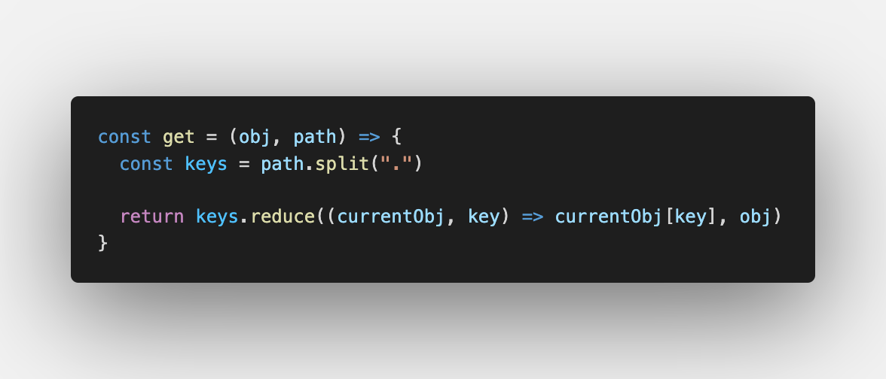
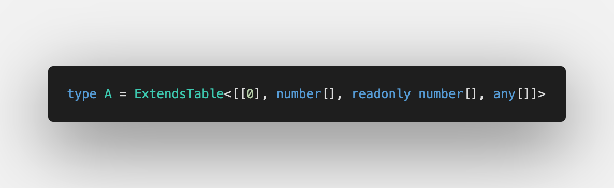
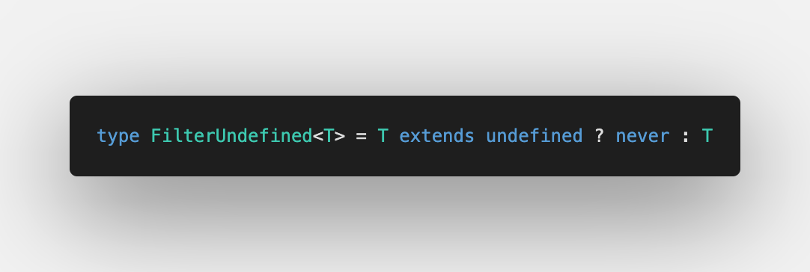
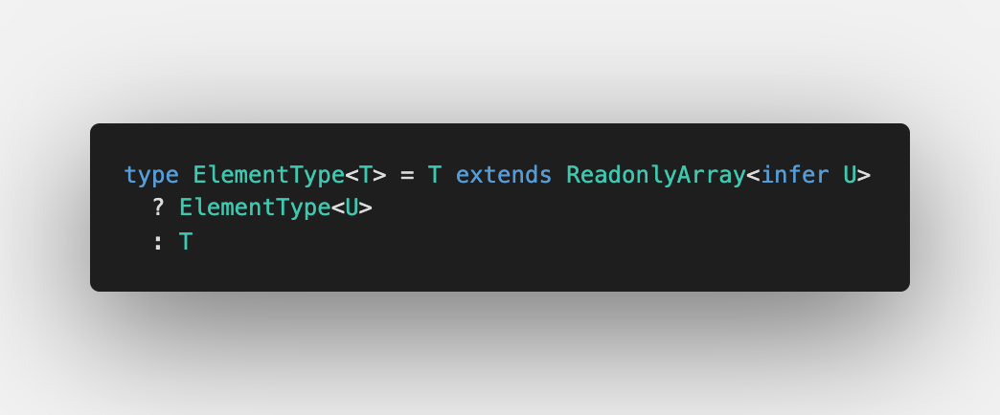

Not a long time ago I revealed [type-challenges](https://github.com/type-challenges/type-challenges) for myself. Today I'll show not only the implementation of `Get`, but also the common issues with the implementation, the following improvements and the usage in production.

## Basic implementation

As I said, there's a repo on GitHub: [type-challenges](https://github.com/type-challenges/type-challenges/blob/master/questions/270-hard-typed-get/README.md). The current challenge is located in "hard" category.

Here we work only with objects (as the solution doesn't require accessing arrays) and also we always can access object keys as they are defined in test cases.

So what should we start then from?

#### Getting keys

Imagine we solve the same challenge in JavaScript:

Before calling `keys.reduce` we need to get a list of keys. In JavaScript we call `path.split('.')`

Similarly in TypeScript: somehow we need to get the keys from the path string

Thankfully, since TypeScript 4.1 we have [Template Literal types](https://devblogs.microsoft.com/typescript/announcing-typescript-4-1/#template-literal-types). We can infer the keys by removing dots.

I will use `Path` type to do so:

It looks very simple and short. However once we write tests, we understand what was missed: [Playground validation](https://www.typescriptlang.org/play?#code/C4TwDgpgBACghsAFgHgCoD4oF4qqhAD2AgDsATAZygAMASAbwEsSAzCAJygGkIQBfAHQNmbTgCUIFYH2oAoKFAD8UANo8QAGigCd8JMglT0AXXlQAXKtOyA9ACooAfWcvXL3JOBQAwnAqSnNyDHKDsbWUYAWzAAe3YveigAUQBHAFc4ABstJIJIAGMvPigWdhjIqAByAAFQSABafMQszNIAc0kbNOBGTIpK2Vk66Hy-AJwVM1yC4GRUjMzkPRRKmJIIeoBrXnqwBERK9C0VVfWtnb2kSuN0I6m8iEK59Kyl-eRKgCZzkAFLg6Oqi+P0qWkq-2utw09xmzwWb30lSQ7AgEAE21+EMBJ2RqNBVQx+PB+0hd2MQA). We forgot the case with only one key left. Let's add it:

To play with it, have a look at [Playground with tests cases](https://www.typescriptlang.org/play?ssl=5&ssc=9&pln=1&pc=1#code/C4TwDgpgBACghsAFgHgCoD4oF4qqhAD2AgDsATAZygAMASAbwEsSAzCAJygGkIQBfAHQNmbTgCUIFYH2oAoKFAD8UANo8QAGigCd8JMglT0AXXlQAXLnxFSlGsNYduvGWYXK1vUwoWWVp2QB6ACooAH0IyKjI3ElgKABhOApJcOj0sKhgwNlGAFswAHt2ePooAFEARwBXOAAbLXKCSABjeL4oFnZCvKgAcgABUEgAWhbEerrSAHNJQOrgRjqKPtlZYegW5NScFTMm1uBkKtq65D0UPsKSCBGAa14RsAREPvQtFSub+8fnpD7jOh3vtmhA2scavVzi9kH0AEw-EACP6vd6qeGIvpaPoogFAjQgw4Q07Q-R9JDsCAQAQPJG4tGfClUrH9WksnEvPHA4xAA)

#### Reducing the object

After having the keys, we can finally call `keys.reduce`. To do so, we use another type `GetWithArray` so we already know that keys are an array of strings:

Let me comment it:

1. `K extends [infer Key, ...infer Rest]` checks that we have at least one element in an array
2. `Key extends keyof O` lets us use `O[Key]` to move recursively to the next step

Let's test it on [Playground](https://www.typescriptlang.org/play?#code/C4TwDgpgBA4hwHUCWwAWBBATpghiAPAPIA0UA0gHxQC85UEAHsBAHYAmAzlANpIsBmETOQghSAOkl9BwgEoQOwALoAoKFAD8IkPSatOUANaiA9vyiE16zbHjI0WXAULcyopaXmKKV9QC4oFggANyErAKDQzBUVAHoAKigAfRTUtNSoABUFYCgAYRwOBWT00qSoeNiVJABbMBNMXIBvKABRAEcAVxwAG1JWhkgAY1yAXyh+TBMaqAByAAFQSABaIdRentYAcwVYzuAkHo5ZmKXobMVCACMAKwgRmigmqwPgTYCAAwBlIamenquOGEQ06immSA4OAOJhYHysbChEE+ACYAAwARgAHMt0ajlqiACxw9Q4faoBoBZ7WQI4GpIqAfdCbBiiKAAISEEAAXnxidYeiYhlCkDDKb5rEMUCBPgBZTosJBrPnqUZWVWqlRnKBCopcWjcKwDYbAfAdbo9fBwRAoDDYPD4C7Aa53EakbizV6bWZKCikb6-Ez-QHA0HAcGQ6Gwii+w2De4ms29S12G2Oe2O53xt2zBHMb2+hlorE4vGEj7R4ix42mrpJq32W1OB05TOung5hS-JBgSP50iRIQVqvxmvm5PWhx2ggZ25Z9uktANWakWYsWkQPsMpmMVkczDc3lD9RGkeJi311NT5uXWdt90L8mYZdzAVC3sryWgTcfOUKpVHto4xGUc6xTScmxnF1gGzB8lw-IE2GfVdOhqK4hE3AdMCHJQgA). We again forgot the last case with empty array. Let's add it then:

[Final version with tests is available on Playground](https://www.typescriptlang.org/play?#code/C4TwDgpgBA4hwHUCWwAWBBATpghiAPAPIA0UA0gHxQC85UEAHsBAHYAmAzlANoC6AUFCgB+KIUFQAXHUbN2XbkhYAzCJnIQQpAHS6lq9QCUIHYAKFDRZTfSatOUANaaA9srESLI2PGRosuASE3NYgvKTGphSeFtIsEABuajFxicn8APQAVFAA+vkFhQVQAComwFAAwjgcJnlFDblQWRn8SAC2YC6YFQDeUACiAI4ArjgANqQDDJAAxhUAvlDKmC7tUADkAAKgkAC0s6gT46wA5iYZI8BI4xwb-Py70GWmhABGAFYQ8zRQvRLXYAnaQAAwAyrNVuNxm8cOpZiNTGskBwcNcXCwQRI2GiIKCAEwABgAjAAOPbEwl7QkAFixQhwV1Q3Wk-y8LBw7TxUBB6BODBsACE1BAAF5KekWcYuWZopAY1kxISzFAgUEAWRGLCQh0lQgWEgNBse4GgstqXFo3Ak0zmwHwwzG43wcEQKAw2Dw+BewHeX3mpG4G0BJw2vAopHBkJc0Nh8MRwGRqPRmIoEZtM2+9sdExdvndAS9Pr9WcDGxxzDDEZ5RLJFKptJBaeIGbtDtGuddfg9gW95RLAZ45ZMkKQYBTVdI8SSmGbraz7adebd-k9BGLn1LQ8ZaG6G1IGw5XMnPL5jCFIvFqfTQltC5zzq7BbXfdem8HQZ3zMw+820tlE4HiqoAniCmrarqc63pm8yLp2+arr2G7+sAZZfnuQFwmwv6HiM7RvGoJ7Tmoc68EAA)

#### All together

Let's test it together to clarify everything's working as expected: [Playground](https://www.typescriptlang.org/play?#code/C4TwDgpgBACghsAFgHgCoD4oF4qqhAD2AgDsATAZygAMASAbwEsSAzCAJygGkIQBfAHQNmbTgCUIFYH2oAoKFAD8UANo8QAGigCd8JMglT0AXXlQAXLnxFSlGsNYduvGWeVrephZZWnZoSCgAcQhgAHVGJABBdnY4EGQAeS0uTBwua2JyKl83KESzSwzCLLsVESd1LR0BCvFJYC8FJWcQTNsqAGteAHsWfLNmlpDwyMQYuITEjxBjLUNgdEHmyxIIADcOZdWNrf9waBGkrRg04NCI6Nj449gEFFOl2QB6ACooAH0v75-v3AaoABhOAUSSfX4Qj5QV7PWSMAC2YB67GAUHoUAAogBHACucAANloMQRIABjVF8KAsdg9eFQADkAAEAhAALSkxAE-GkADmkmeOOAjHxFHpsn2gVQDUSACMAFYQcnYNFmIXAbmWagAZVJNPx+JlcE4pJxUlpjAoCEYPRIcgUZAQEE1ACYAAwARgAHKz3a7Wa6ACx2qBwQWIZGWejLEhweFOmhRbkEXhQABCHAgAC9mMGFPieqSrTbI8sFKTIiBNQBZHEkRgc3NQPhmZvNiXQQugqg4FRmYlk4DIbF4-HII5SqSyhXkrT0tXc+noLTa3U9fWG42m4Dmy1Cm3UdBLvskxWD4cEsehNDS+Wn2cO4iL5dur0+v2Bg9HhT909D3EX8cb2nYB70kXVGDAPcSCfKA1k2dhDw0Y8Bz-EdL0HCdgCnO8GVDJBkQEGM4xg6hE0IFN03YLMc0Q5Df3PUdAMnW8Z1wsMCPzQsoIEctQBIms6wbWjvxPclUIAq9MOw1j6Tw8N2B4o0yEInF4RlDgYLgjhaOMIA)

Great, we did it ✅

## Optional paths

When we work with the real data in production, we don't actually know if the data is given or not. In this case we have optional paths all over the project

Let's add test cases with optional paths and see what happens: [Playgound](https://www.typescriptlang.org/play?#code/C4TwDgpgBACghsAFgHgCoD4oF4qqhAD2AgDsATAZygAMASAbwEsSAzCAJygGkIQBfAHQNmbTgCUIFYH2oAoKFAD8UANo8QAGigCd8JMglT0AXXlQAXLnxFSlGsNYduvGWeVrephZZWnZoSCgAcQhgAHVGJABBdnY4EGQAeS0uTBwua2JyKl83KESzSwzCLLsVESd1LR0BCvFJYC8FJWcQTNsqAGteAHsWfLNmlpDwyMQYuITEjxBjLUNgdEHmyxIIADcOZdWNrf9waBGkrRg04NCI6Nj449gEFFOl2QB6ACooAH0v75-v3AaoABhOAUSSfX4Qj5QV7PWSMAC2YB67GAUHoUAAogBHACucAANloMQRIABjVF8KAsdg9eFQADkAAEAhAALSkxAE-GkADmkmeOOAjHxFHpsn2gVQDUSACMAFYQcnYNFmIXAbmWagAZVJNPx+JlcE4pJxUlpjAoCEYPRIcgUZAQEE1ACYAAwARgAHKz3a7Wa6ACx2qBwQWIZGWejLEhweFOmhRbkEXhQABCHAgAC9mMGFPieqSrTbI8sFKTIiBNQBZHEkRgc3NQPhmZvNiXQGA0sg48nWkiyhVKnBR+2SXWMMBCm2KSxSdjMHkAblVkQ1UDnC+X9sds+A85IS7MoaQyJnKqGMbju-3h6G+cLU5IZ5HQyg5dA183y2bClb4pZb4gmCOAqGYbxQMQUiAaCVAwmYxJksAyDYni+LIEcUpSAOirAFo9Jqty9LoFo2q6j0+qGsaprAOalqPtQ6DEfBJI4chuIEuhoRoNK8o4XhDrEERJFul6Pp+oGDFMQoCGsShHEYTxg64QyZBjvOk59kJUBrJs7CMRozGIWxqGcUhmHANh5J4ce4bsAIl4QFp1CJoQKbpuwWY5vphmyexaEKVhvFWQyNnIgI95FiQAjviATk1nWDbedJLHksZ8lceZlnKfSoV2YW7BkPZOLwjKHBaTpHBJVA4FgF2PaPtBYJwclRlyf5XGdj03a9jaWV4QRjnEeue4LlVMmpW1pnIJ13WPn1KmOlpG4HmNKVIZNRwzfVfbzfSqkUOOGk2ktI0HlAAA+UC1qpLDMBAZCra1flTVtPX9kF2W5fZsaDVoy08hdV3kBAt1rA9UmYmtaXtUhr1zR91lhmFEWPtFFYnTegPXSDd3gwZLW+SZm11W9u1fflhUkMVpXsFp2Og-d3nGEAA)

Optional paths are not working properly. The reason behind it is simple. Let's go through one example to find the problem:

We cannot extract a key from an object if it can be `undefined` or `null`

Let's fix it step by step:

#### Remove undefined, null or both

First, we declare 3 simple filters:

We detect if `undefined` or/and `null` exist within the union type, delete it from the union. At the end we work only with the rest.

Let me show the test cases on [Playground](https://www.typescriptlang.org/play?#code/C4TwDgpgBAYglgG2BATgVQHYBMIDM4YRYA8AKgHxQC8UpUEAHstgM5QCu2eBRUA-FEIA3VFABctAFCTQkWImQoAcuwQIylGnUbMsbDKoT9BEESnFSZ4aPCSpMOfISwBBbCrUbq8u+i5OiYltFD3UKcmkAegAqKAB9BMSkxNoIFmAoAGEAQxY0+OTCuKhoyMk4AFswAHsUDIBvKABRAEd2bIQAGmaGSABjDIBfKFwUaoqoAHIAAVkIAFo+gAsOhAgMAHM0yPZgRBZJ6TmoPtz8mgBtSSge-uBiVvb1YPt-Hld3Q2IARigAHygACZ-lAAMwgziOd7kbq-AHAgGg8gw663CADB5tDpBBSvKHONxYULESbVQiTEGTYAAd2qFIBVKWKAgEHpgkMMKmZNZlJpdN5TJZk2RnVRTV66Puj2xLz8+KIhOJcKmfLZBjUELezk5yqptOFKJu4rumKeON8Dm4BM+nkhVqInOEqBFYolGOlz1xcvtHyJX3VCEdpmdhrR7qxnotWoVNvUdoCWBBAaDZhdAF0gA)

#### Modify reducer

Remember what we did for type challenge. Let's extend our solution to support optional paths:

1. We need to make sure the key exists in keys of optional object
2. Otherwise, we say it doesn't exist

Let's add tests and check if it's working: [Playground](https://www.typescriptlang.org/play?#code/C4TwDgpgBAYglgG2BATgVQHYBMIDM4YRYA8AKgHxQC8UpUEAHstgM5QCu2eBRUA-FEIA3VFABctAFCTQkWImQoAcuwQIylGnUbMsbDKoT9BEESnFSZ4aPCSpMOfISwBBbCrUbq8u+i5OiYltFD3UKcmlZaABxCGAAdThgAAsXFBQAQxBiAHkAGigAaU0i+iYIVigAbQBdSShjHPqLQrLdNiqCXFFCiBACgDohrtEAJQgWYDqGhoFekDaKvSgAaz6Ae1woJpmZgViEpNT0rNyq+ZqC8cmI3YaJecXKtZBNn0UHbmc3LFDc27usygB0SKTSmWywXs-h4rnchn+5z6lyg12AlAAPhwYc5moCJJxHLC8RZhKhpAB6ABUUAA+vSGYyGbQJsAoABhDIsCZ0pl82lQKkUyRwAC2YHWKDZAG8oABRACO7AyCAKcoYkAAxmyAL5QXAodaiqAAcgAAlEALSa5IqhAVADmEwp7GAiBYJsi1igAAVDVh2Nq4OsMDkAEYAKwg2u80uaOBYmpQcDAbpDfAkk2TGAdzTdwHtmeA2dzDSwGWQRZLzQyruSkozUDjuwwGVFECrBFLMwQ601FeDGEbzbumqSIE7OZJOuaM5nVjk-e5bBoVWa6q1wGIiuV6hBR3Bpz96wDQZD4aj2oKVRN+ftJpq5AKWa75Cf6410a3O5VxH3YJObJj1PNNQ0jL9rxNctkAfJ8oBfHM3zyD9N23JVf3-Y4IWIYDA1Ai8IOqKCJiTFNQNg59iy7KAsUJL4iCQlCvzQ3c-ziUEsKPf08MHAiryI2sUklE0ChNVt2wo+CqJzGjsSJZxGIaDdmJ-Pd2IPQCcO4s8wMvYBIME+sUBE01e37cjRLHUBJIQh1ZLogIsEU+VP21FiMPUgDsNwnS+P0gS62EyyMhQLATLE9hRTDVBJIc2FGJqIA)

Good job ✅

## Accessing arrays

The next desired step for me is to support arrays

The indices will be [string literals](https://www.typescriptlang.org/docs/handbook/literal-types.html#string-literal-types) as we declare the path as a string

First, let's check why we don't use `GetWithArray` as is for arrays:

#### Reducing objects and arrays

Let's have examples to understand it better. I added `keywords` and `tags` to `ProductionObject`. Let's have a look: [Playground](https://www.typescriptlang.org/play?ssl=20&ssc=6&pln=20&pc=22#code/C4TwDgpgBAYglgG2BATgVQHYBMIDM4YRYA8AKgHxQC8UpUEAHstgM5QCu2eBRUA-FEIA3VFABctAFCTQkWImQoAcuwQIylGnUbMsbDKoT9BEESnFSZ4aPCSpMOfISwBBbCrUbq8u+i5OiYltFD3UKcmlZaABxCGAAdThgAAsXFBQAQxBiAHkAGigAaU0i+iYIVigAbQBdSShjHPqLQrLdNiqCXFFCiBACgDohrtEAJQgWYDqGhoFekDaKvSgAaz6Ae1woJpmZgViEpNT0rNyq+ZqC8cmI3YaJecXKtZBNn0UHbmc3LFDc27usygB0SKTSmWywXs-h4rnchn+5z6lyg12AlAAPhwYc5moCJJxHLC8RZhKhpAB6ABUUAA+vSGYyGbQJsAoABhDIsCZ0pl82lQKkUyRwAC2YHWKDZAG8oABRACO7AyCAKcoYkAAxmyAL5QXAodaiqAAcgAAlEALSa5IqhAVADmEwp7GAiBYJsi1igAAVDVh2Nq4OsMDkAEYAKwg2u80uaOBYmpQcDAbpDfAkk2TGAdzTdwHtmeA2dzDSwGWQRZLzQyruSkozUDjuwwGVFECrBFLMwQ601FeDGEbzbumqSIE7OZJOuaM4aLwA7pK9JOHbUANx5jIOlgSKomqKJ5Opk0FE0oCAZbUmuozqxyFwARm8IKO4NOfvWAaDIfDUe1BT7ouy4egUAAMNTkOuUAUhSUBZl2UCADLk97QC4ABML5xKCxwQsQn7fmmoaRtGwCASawEoHop6mmBN5QTBcGEl8vAoahUD9tybA0FUzTqlqwDEIqyrqK+YInNkBGBkRf6keR+b2vRBQITm5DkHkfEaqRQlKiqxBibhH7+tJg6yQB1QmuWyBKfBxZdmpGkNPx2nCXpBnvpJxk-sR-5kRZCZJimRE2SpDpQFizEBFgDmaQJOkifp2FvhJ+FeTJJHmfutYpJKNEmq27YhXZObhdiRLODFTladq8VuUl4l4VJ3lmX5WV1rlZ69v2wVnmOoBFSWpWRbClXytVgmuaJ9WGZ5X4mb+GWtSa2X1igeX9lReUGKKYaoDZw0VepzTUjSGQSWwQqxS5ulTYcDVGXNzWLeRlHUWedGQcpxVhRFOJEKNzk1ZNiV3TNqWPelvkvX0S5UaBUAQeptmDb95X-UdVVxcD7kpU1kNyRZwDbvDJofUjB7WEeQUmgD421bdOEeeDhGmc9hPEzRiNnoegUnjFNRAA)

We see that readonly arrays are working perfect while normal arrays are not:

Let me have another example to make it clear:

By default, if you don't use `noUncheckedIndexedAccess` in tsconfig, it will infer `string` in all the cases. The same in types: by default index access will lead to `string` however I expect `string | undefined`

#### Tests

Before starting, let's add test cases:

1. If there is a specific readonly array (e.g. `[0, 1, 2, 3]`)
   - For existing index, we expect exact value (e.g. `0` for `'0'`, `1` for `'1'` and so on)
   - For non-existing index, we expect `undefined`
2. For other cases (e.g. `number[]`, `readonly number[]`) we expect `number | undefined`

You can see even more test cases in [Playground](https://www.typescriptlang.org/play?noUncheckedIndexedAccess=true#code/C4TwDgpgBAggTnAhiAogGwgWwgO2AHhgBooBpAPigF4ocIA3COAbgChWB6AKigH1+BggVAAqEAM7AoAYUTiJfIUt5QuHVgEtMYAPZwpAbygoAjgFdEaEigAekAMZSAvlABmcHZigByAAKhIAFp7AAtLDBwAcwkOM2ANNHFvdnsdHEkoRARqKABtAAYSAEYSACYSAGYAXVZU9Kk6yXg4HILissqqzPEoRuB2AOh7OQlS1tYoKG5MxJ0ocTMwXX1aM0wAIyZA4B1AnDXNlrUJ4zsIR3xTCzRCBGR0LFwCNqgSqHKoapJvfO9yEny5H+J1sDgIV0styQqAw2Dw+Bebw+Xx8RT+xSBRBBZwuEJuzXusKeCMKrw6nyq31K6PemOxYMu5khBJhj3hiPJKO8FRpFTpk1B53BTPxd1ZcOepKRnW+ABYaWYcAATCCuDR0JX804MvFQwlsgiDHSuXppJoIb6-f5QQHAgU44XXPXi4lGk19ZrfNHWopawW4kXOh4S-Bu031T0+anW0p+h2Mp0s4Ou8AQY3h81wb48618u3aoUJ5li5PwsMei0+eXWxUqtUauM6wNJonw-YbJi5Sk+K0kduHKAAHygtdV6ogmvz-sdxehpYI-c73e83r7ByYQ5HyrHDan8d1LYN+EXcC7VJpJ83o-rE8bhYPJdbC-Xp+XObXHZaw+v48nWPtTaJo+R4nmeVYXi+V7bjef70vezbASGAAUl7DpIcDqpEACUYHeNWH4DmhwAYVEUF1r+d4BkBc5PvgKGQd+0G-jhy74asn5kTut57oBs76iGYZZFmPYQRxjHkbu-4FlRfEumWqbpkJXqiYRW4SdxUnTkWoo0UegmVt40YERu4lcbBAHwdR-EppAikGe+7GqT+klwTJOnWfJtkmkp4HWqhalmZRM7uXJBBwBAiBKmkaAgI5S6WipJkBTBQXaUGtHhZF0WxaBy6rnFX7JRRPGWbJ874JlUU4DFBW4UZBWcSlJVuelR6VdltVvolhXORprnBa1IbtdVOUvrhbH+b1sFVEAA)

#### First attempt

Let's implement something simple and short:

Now we covered all the cases with specific readonly arrays (e.g. `[0, 1, 2, 3]` or `typeof constArr`): [Playground](https://www.typescriptlang.org/play?noUncheckedIndexedAccess=true#code/C4TwDgpgBAggTnAhiAogGwgWwgO2AHhgBooBpAPigF4yoIAPYXAEwGcoBrCEAewDNYAKChQA-LADapALrCoALigBXHMwh8AljgjMA3IMEB6AFRQA+hctXLUACoRWwKAGFErB+etezUY4cEamGA8cE4A3lAoAI5KiGgkKPSQAMZOAL5QfHA8mFAA5AACoJAAtMkAFnEYOADmDoZKwBporHkGyTw4jlCICNRQEgAMJACMJABMJADMsh1dTnOO8HD9Q6MT09I97IvABsXQyW4O46tyJj0tPFCsSmDBoVA4SpgARhBwJcA8Jc9vH75-CJEikCNFYmhCAhkOgsLgCGsoGMoJMoDMSHlBnlyCRBuQcXIQRBUvhwXEoUhUBhsHh8Ijkaj0fkRtjRviiISksSwTFycsYdT4XThkiNmjpBjxqyUezOaDSbzIfyqXDafSxUy8lNpVNZcCuSSyUroSqaQiRQzNhiACzSlRqTTaZh6yIGnkQikC1UEA78KC7ZYYrE4qB4gn6+VGz2moW+gQBhAYlkhkYuomGxXR2Fm-Bx-2dJaJ-JSkPjNNuhUe5XZ2PgCB+hNwDHakO68OuyOZ6uC2l5xs2u2qdRaHTlztVk012l-d5wCQS-LBkgzgEAH2UQ8do-b6fdfMnPYIK7nC7yyeXL1nUHX9uHTrH3Mr+8pU6Pl4+88l0uP143DpHzo7hWUbdt6+DHp++Qthe-wrDem4AQ+GYTi+h7ge+J4DiGP7wf+95AeOz5ejmAAUOE3MAcBaDUACUkF5La2EYb+jhUbUv63lugEchGj4gQeYFkcxuF3jodGnoxMFXiJXFIXuxqoWBea9E2i7fsJf6idxcp8V2Ak5spRZnupsEcQh+E8R2ukocRtaQH6KlfkxpkyYhBHWURMa9nWDlGdBTwaZxbmWbuT4KbZ3n2QIjn5JJAUuZpsnuchnmvvgcAQIgzCdGgIDxbO9FLvla6JcFOkpeFXkEBlWU5XlEGnuexVwaVFnlfJWZoTV2U4LlzX0SWUklUFbW8RVnVgd1dX9ae-nkSN24hcBemKTmU29fVGH0XF83mYtgjSEAA)

It works for several reasons:

1. All `'0'`, `'1'`, `'2'` and `'3'` extends `keyof [0, 1, 2, 3]` which equals to `number | keyof [0, 1, 2, 3]` and can be therefore string too (not only number) ✨
2. Other arrays (e.g. `number[]`, `readonly number[]`, etc) cannot have a string as a key, what's why 🤓

Let's fix that 🚀

#### Another try

In all other cases we need `T | undefined` depending on the values inside the array. Let's infer that value:

By fixing other cases, we just broke the case with non-existing index for specific readonly arrays where we expected `undefined`: [Playground](https://www.typescriptlang.org/play?noUncheckedIndexedAccess=true#code/C4TwDgpgBAggTnAhiAogGwgWwgO2AHhgBooBpAPigF4yoIAPYXAEwGcoBrCEAewDNYAKChQA-LADapALrCoALlh1GLdgAoAljj4Q4UACoBKCbJEjx+qAB8oAVxzMIfLRGZyRi+4+c5XAbkFBAHoAKigAfUio6KiDCFZgKABhRFZ4iJjM8KgQoMENTDAeOESAbygUAEdbRDQSFHpIAGNEgF8oPjgeTCgAcgABUEgAWiaAC1qMHABzeKDbYA00Vl7App4cBKhEBGooCQAGEgBGEgAmEgBmWXXNxNuE+D0aQ5Pzq+lt9gfgQKHoJqpeJnPYSOShbbLHhQVi2MBFEpQHC2TAAI10w2APGGyLRuhyeREDWaBCqNTQhAQyHQWFwBFeUFOUAuUGuJF6B165BIB3I3LkxIgLXwZNqlKQqAw2Dw+AZTJZbL6xy5Jz5RAFjSFpOqYqe1KldNlR0Z71Z0nZZxVzLVGpJIp1FL1ktpMrlpsVvUuVsuNqJmuFosdVOd0vpxvlH3ZABYrV4nC5mL6Kv7teTxfqXQR-vwoD8nuzOdyoLz+X67YH0yHDdmBHmEOzlUXjknBQGHZWaaH8DXcxtHvW+pai2cWyn7WmnZ3q+AIDm63B2V6iz7S8ny+3JwaZT359HYw5475E6vW6ndcGpzLcei4CYC1br-ibHGfK5R+uJxetwRH7fzUqHxRG9rDsA9X2PdUyy1cdzwlS8fyA3Q70HQC8T0Z8wITd9oIrTdM3wX9kM9VDgIw7wsJPMdcK-fDCP-XoYyLX8QJfCjILXHCNxors1GYmwEjgLRpmMejGJIPiYWAQSZhYzCj2wttPzg798F4xD0NA8ijxEvcmPU2StLfSiP1gjMux7HYFz6QtxP0sjDyM9jTxgoNlPwiyB16RtbLQgyHIg21OKUszp0gHNLItEin00-yFLPVyQu3Gdws8pcfNImLwLilyOxUjyrIYqKNNY+TjKC0yqxlOAIEQZgNjQEAkXUoibKa3z7KysrFIq+D8Gq2r6sauiGyKvzOqcqiuLcrt+rqnAGram8iKHdLopKxzAu6hLKoIWbBsWpD6LSg7irkjaoK23L8L2+ahua0TRo6tjBGkIA)

This happened because we started inferring the value type for this array: instead of `undefined` we now get `0 | 1 | 2 | 3 | undefined` which is completely opposite to what we want to have.

The solution is possible once we differ specific readonly arrays from others. Let's think how we can do that.

#### Investigation around extends

Let's investigate a bit. I will use `ExtendsTable` as the way to find the correct type:

Let's use it for different types:

1. `[0]`
2. `number[]`
3. `readonly number[]`
4. `any[]`

Let me create the table to clarify what is located inside `A`:

|                     | `[0]` | `number[]` | `readonly number[]` | `any[]` |
| :------------------ | :---: | :--------: | :-----------------: | :-----: |
| `[0]`               |  ✅   |     ✅     |         ✅          |   ✅    |
| `number[]`          |  ❌   |     ✅     |         ✅          |   ✅    |
| `readonly number[]` |  ❌   |     ❌     |         ✅          |   ❌    |
| `any[]`             |  ❌   |     ✅     |         ✅          |   ✅    |

We just created the table of `extends` for TypeScript types.

You need to read it like this: if you see ✅ for row `[0]` and column `readonly number[]`, it means `[0] extends readonly number[]` is `true`. If on the other hand it's ❌ for row `readonly number[]` and column `number[]`, it means `readonly number[] extends number[]` is `false`

Let's take a closer look at row `any[]`: for column `[0]` it's ❌, but for other types it's ✅

This is actually an answer 🔥🔥🔥

#### Array Element

Let's sum up what we just did:

1. We distinct others array from custom readonly arrays like `[0]` using `any[] extends A`
2. For normal arrays we infer element type
3. For custom readonly array we extract value if index is existing
4. Otherwise, we return `undefined`

If you want to see it in one place, don't forget to check ou [Playground](https://www.typescriptlang.org/play?noUncheckedIndexedAccess=true#code/C4TwDgpgBAggTnAhiAogGwgWwgO2AHhgBooBpAPigF4pEcQBtAXSggA9hcATAZ1gCgoUAPyxWHbnwAUASxwAzCHCgAVAJTNBQkaqgAfKAFccXCPLkQuWoQC4x7Tib5wIiLgHscaEFFkKlqhpM1tqiKvpGJmYWVtradsam5jiWWnak4o68UADWECDu8gJxQqIwDKTBJVAJUcmp-AD0AFRQAPodnV2dqhA8wFAAwog8fe3dE21QzY38Mphg7nADAN5QKACOhohoJChskADGAwC+UPJw7phQAOQAAqCQALSHABY7GDgA5n2NhsAyNA8G78fiHTz9WgIahQBgABhIAEYSAAmEgAZmC4JwkOx-Xgyho8KRqIxLBGUDxwFBjUaUEe0AAIhAAEaGL5fORfACcMIJyHQWFwBBcbk83igOEMmBZSmYJBuABYbuRQQzKSMxkStC1aED3FAeIYwItlpLpbK4E9gO4nlKZQEZlp9kcCJttmhCAgBRhsHh8MSoMioGioJiFXCVSQ4eRyERnQcIMd8O6dl6kKhfcKAwig6Sw0wFYio0HY-GhC6k26tmn+Zmhf7A8HQ+HbiiSyiywnXSma5664K-QQm-nWzd0SX0V2K4nk6n+9760OcySQ2SFcq45EkjFp+tZ9WPemfQ2CAzCpSIcACRGSzG492q72jwOs-7z0UqTfbsWt4i95Wc59seS7Zh+l44teCAKu2W6dg+M49vOIGDmB4AQBeX7QbcE5blOCH7khwGvqe+DgVhcAbiWiTRCkXAAQez61ouqH+valryrckZbuxAQGDR9T0QRgGHsxGasQQvFwJxNy-iQUkRAJu7CYxyEkcuUkybB8kWnx260ZYDFES+LFvpJunSYWOElgp-F1Mp5aEU+ammaRmlWUqNkWYp9l0UZznEa5y5SLZhrAHAXJBFRPHeQY-QRd8Pk7n5KnGWJJ7BaFSl0VFtybjpDrKHZyWGalAUmeJZlkehF6INhNzcQVlpJQZQmOSJTELpVpHgXVlE-l5hUtYJ-lARVGVoZAtX1dp5pDcVrWjaJXUTe+NVFH1Cq4U1enZaV7WqYF3XLr19X5XNzULSNZVjeloH+qKHheD47m3jF836ddB1pSt90iq4T0Sq9A3vZdn0OY+t2-RJ+CPeKL0WVpg1g3tbWQ8tKFVXDz0XXKHnbbjRXgyl33lXdMPY0DiMeedWW+ft-BMEAA) ✅

## Summary

To solve the challenge we needed to know several TypeScript concepts:

1. [Conditional types](https://www.typescriptlang.org/docs/handbook/release-notes/typescript-2-8.html#conditional-types) which were introduced in TypeScript 2.8
   
2. [`infer` keyword in conditional types](https://www.typescriptlang.org/docs/handbook/release-notes/typescript-2-8.html#type-inference-in-conditional-types) which was also introduced in TypeScript 2.8
   
3. [Recursive conditional types](https://devblogs.microsoft.com/typescript/announcing-typescript-4-1/#recursive-conditional-types), which were introduced in TypeScript 4.1
   
4. [Template Literal types](https://devblogs.microsoft.com/typescript/announcing-typescript-4-1/#template-literal-types), which were also introduced in TypeScript 4.1
   
