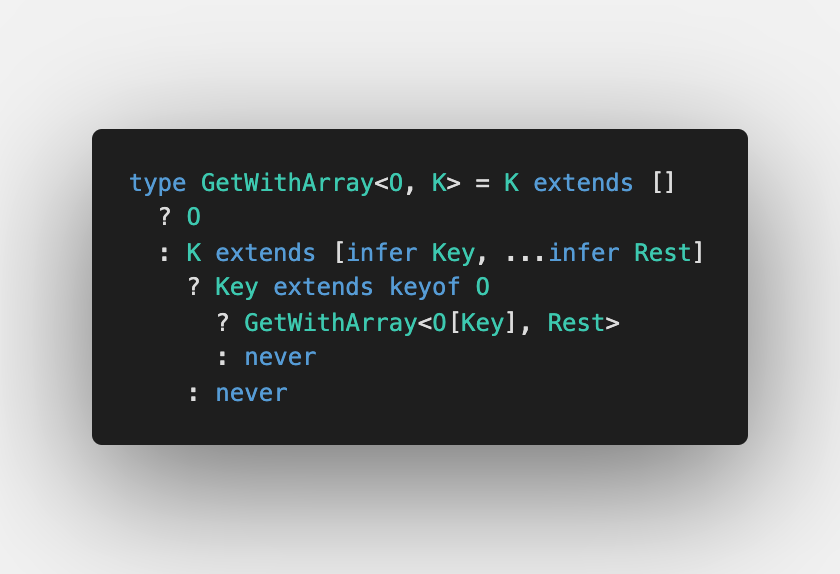
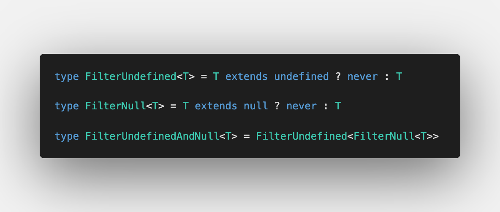
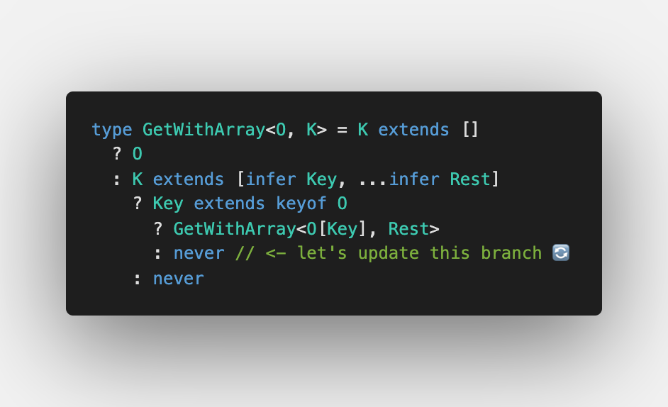
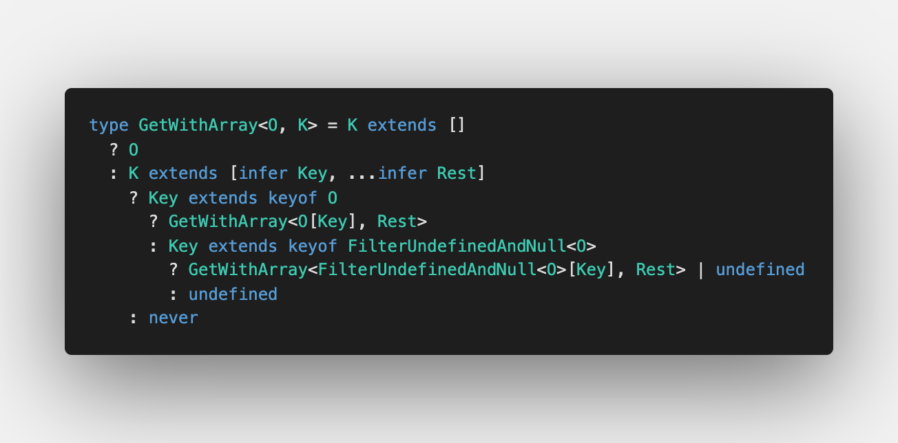

Not a long time ago I revealed [type-challenges](https://github.com/type-challenges/type-challenges) for myself. Today I'll show not only the implementation of `Get`, but also the common issues with the implementation, the following improvements and the usage in production.

## Basic implementation

As I said, there's a repo on GitHub: [type-challenges](https://github.com/type-challenges/type-challenges/blob/master/questions/270-hard-typed-get/README.md). The current challenge is located in "hard" category.

Here we work only with objects (as the solution doesn't require accessing arrays) and also we always can access object keys as they are defined in test cases.

So what should we start then from?

### Getting keys

Imagine we solve the same challenge in JavaScript:

```js
const get = (obj, path) => {
  const keys = path.split(".")

  return keys.reduce((currentObj, key) => currentObj[key], obj)
}
```

Before calling `keys.reduce` we need to get a list of keys. In JavaScript we call `path.split('.')`

Similarly in TypeScript: somehow we need to get the keys from the path string

Thankfully, since TypeScript 4.1 we have [Template Literal types](https://devblogs.microsoft.com/typescript/announcing-typescript-4-1/#template-literal-types). We can infer the keys by removing dots.

I will use `Path` type to do so:


It looks very simple and short. However once we write tests, we understand what was missed: [Playground validation](https://www.typescriptlang.org/play?#code/C4TwDgpgBACghsAFgHgCoD4oF4qqhAD2AgDsATAZygAMASAbwEsSAzCAJygGkIQBfAHQNmbTgCUIFYH2oAoKFAD8UANo8QAGigCd8JMglT0AXXlQAXKtOyA9ACooAfWcvXL3JOBQAwnAqSnNyDHKDsbWUYAWzAAe3YveigAUQBHAFc4ABstJIJIAGMvPigWdhjIqAByAAFQSABafMQszNIAc0kbNOBGTIpK2Vk66Hy-AJwVM1yC4GRUjMzkPRRKmJIIeoBrXnqwBERK9C0VVfWtnb2kSuN0I6m8iEK59Kyl-eRKgCZzkAFLg6Oqi+P0qWkq-2utw09xmzwWb30lSQ7AgEAE21+EMBJ2RqNBVQx+PB+0hd2MQA). We forgot the case with only one key left. Let's add it:


To play with it, have a look at [Playground with tests cases](https://www.typescriptlang.org/play?ssl=5&ssc=9&pln=1&pc=1#code/C4TwDgpgBACghsAFgHgCoD4oF4qqhAD2AgDsATAZygAMASAbwEsSAzCAJygGkIQBfAHQNmbTgCUIFYH2oAoKFAD8UANo8QAGigCd8JMglT0AXXlQAXLnxFSlGsNYduvGWYXK1vUwoWWVp2QB6ACooAH0IyKjI3ElgKABhOApJcOj0sKhgwNlGAFswAHt2ePooAFEARwBXOAAbLXKCSABjeL4oFnZCvKgAcgABUEgAWhbEerrSAHNJQOrgRjqKPtlZYegW5NScFTMm1uBkKtq65D0UPsKSCBGAa14RsAREPvQtFSub+8fnpD7jOh3vtmhA2scavVzi9kH0AEw-EACP6vd6qeGIvpaPoogFAjQgw4Q07Q-R9JDsCAQAQPJG4tGfClUrH9WksnEvPHA4xAA)

### Reducing the object

After having the keys, we can finally call `keys.reduce`. To do so, we use another type `GetWithArray` so we already know that keys are an array of strings:


Let me comment it:

1. `K extends [infer Key, ...infer Rest]` checks that we have at least one element in an array
2. `Key extends keyof O` lets us use `O[Key]` to move recursively to the next step

Let's test it on [Playground](https://www.typescriptlang.org/play?#code/C4TwDgpgBA4hwHUCWwAWBBATpghiAPAPIA0UA0gHxQC85UEAHsBAHYAmAzlANpIsBmETOQghSAOkl9BwgEoQOwALoAoKFAD8IkPSatOUANaiA9vyiE16zbHjI0WXAULcyopaXmKKV9QC4oFggANyErAKDQzBUVAHoAKigAfRTUtNSoABUFYCgAYRwOBWT00qSoeNiVJABbMBNMXIBvKABRAEcAVxwAG1JWhkgAY1yAXyh+TBMaqAByAAFQSABaIdRentYAcwVYzuAkHo5ZmKXobMVCACMAKwgRmigmqwPgTYCAAwBlIamenquOGEQ06immSA4OAOJhYHysbChEE+ACYAAwARgAHMt0ajlqiACxw9Q4faoBoBZ7WQI4GpIqAfdCbBiiKAAISEEAAXnxidYeiYhlCkDDKb5rEMUCBPgBZTosJBrPnqUZWVWqlRnKBCopcWjcKwDYbAfAdbo9fBwRAoDDYPD4C7Aa53EakbizV6bWZKCikb6-Ez-QHA0HAcGQ6Gwii+w2De4ms29S12G2Oe2O53xt2zBHMb2+hlorE4vGEj7R4ix42mrpJq32W1OB05TOung5hS-JBgSP50iRIQVqvxmvm5PWhx2ggZ25Z9uktANWakWYsWkQPsMpmMVkczDc3lD9RGkeJi311NT5uXWdt90L8mYZdzAVC3sryWgTcfOUKpVHto4xGUc6xTScmxnF1gGzB8lw-IE2GfVdOhqK4hE3AdMCHJQgA). We again forgot the last case with empty array. Let's add it then:



[Final version with tests is available on Playground](https://www.typescriptlang.org/play?#code/C4TwDgpgBA4hwHUCWwAWBBATpghiAPAPIA0UA0gHxQC85UEAHsBAHYAmAzlANoC6AUFCgB+KIUFQAXHUbN2XbkhYAzCJnIQQpAHS6lq9QCUIHYAKFDRZTfSatOUANaaA9srESLI2PGRosuASE3NYgvKTGphSeFtIsEABuajFxicn8APQAVFAA+vkFhQVQAComwFAAwjgcJnlFDblQWRn8SAC2YC6YFQDeUACiAI4ArjgANqQDDJAAxhUAvlDKmC7tUADkAAKgkAC0s6gT46wA5iYZI8BI4xwb-Py70GWmhABGAFYQ8zRQvRLXYAnaQAAwAyrNVuNxm8cOpZiNTGskBwcNcXCwQRI2GiIKCAEwABgAjAAOPbEwl7QkAFixQhwV1Q3Wk-y8LBw7TxUBB6BODBsACE1BAAF5KekWcYuWZopAY1kxISzFAgUEAWRGLCQh0lQgWEgNBse4GgstqXFo3Ak0zmwHwwzG43wcEQKAw2Dw+BewHeX3mpG4G0BJw2vAopHBkJc0Nh8MRwGRqPRmIoEZtM2+9sdExdvndAS9Pr9WcDGxxzDDEZ5RLJFKptJBaeIGbtDtGuddfg9gW95RLAZ45ZMkKQYBTVdI8SSmGbraz7adebd-k9BGLn1LQ8ZaG6G1IGw5XMnPL5jCFIvFqfTQltC5zzq7BbXfdem8HQZ3zMw+820tlE4HiqoAniCmrarqc63pm8yLp2+arr2G7+sAZZfnuQFwmwv6HiM7RvGoJ7Tmoc68EAA)

### All together


Let's test it together to clarify everything's working as expected: [Playground](https://www.typescriptlang.org/play?#code/C4TwDgpgBACghsAFgHgCoD4oF4qqhAD2AgDsATAZygAMASAbwEsSAzCAJygGkIQBfAHQNmbTgCUIFYH2oAoKFAD8UANo8QAGigCd8JMglT0AXXlQAXLnxFSlGsNYduvGWeVrephZZWnZoSCgAcQhgAHVGJABBdnY4EGQAeS0uTBwua2JyKl83KESzSwzCLLsVESd1LR0BCvFJYC8FJWcQTNsqAGteAHsWfLNmlpDwyMQYuITEjxBjLUNgdEHmyxIIADcOZdWNrf9waBGkrRg04NCI6Nj449gEFFOl2QB6ACooAH0v75-v3AaoABhOAUSSfX4Qj5QV7PWSMAC2YB67GAUHoUAAogBHACucAANloMQRIABjVF8KAsdg9eFQADkAAEAhAALSkxAE-GkADmkmeOOAjHxFHpsn2gVQDUSACMAFYQcnYNFmIXAbmWagAZVJNPx+JlcE4pJxUlpjAoCEYPRIcgUZAQEE1ACYAAwARgAHKz3a7Wa6ACx2qBwQWIZGWejLEhweFOmhRbkEXhQABCHAgAC9mMGFPieqSrTbI8sFKTIiBNQBZHEkRgc3NQPhmZvNiXQQugqg4FRmYlk4DIbF4-HII5SqSyhXkrT0tXc+noLTa3U9fWG42m4Dmy1Cm3UdBLvskxWD4cEsehNDS+Wn2cO4iL5dur0+v2Bg9HhT909D3EX8cb2nYB70kXVGDAPcSCfKA1k2dhDw0Y8Bz-EdL0HCdgCnO8GVDJBkQEGM4xg6hE0IFN03YLMc0Q5Df3PUdAMnW8Z1wsMCPzQsoIEctQBIms6wbWjvxPclUIAq9MOw1j6Tw8N2B4o0yEInF4RlDgYLgjhaOMIA)

Great, we did it ✅

### Summary

To solve the challenge we needed to know several TypeScript concepts:

1. [Conditional types](https://www.typescriptlang.org/docs/handbook/release-notes/typescript-2-8.html#conditional-types) which was introduced in TypeScript 2.8
   
2. [`infer` keyword in conditional types](https://www.typescriptlang.org/docs/handbook/release-notes/typescript-2-8.html#type-inference-in-conditional-types) which was also introduced in TypeScript 2.8
   
3. [Recursive conditional types](https://devblogs.microsoft.com/typescript/announcing-typescript-4-1/#recursive-conditional-types), which was introduced in TypeScript 4.1
   
4. [Template Literal types](https://devblogs.microsoft.com/typescript/announcing-typescript-4-1/#template-literal-types), which was also introduced in TypeScript 4.1
   

## What if path doesn't exist

When we work with the real data in production, we don't actually know if the data is passed or not. In this case we have optional paths all over the project

Let's add test cases with optional paths and see what happens: [Playgound](https://www.typescriptlang.org/play?#code/C4TwDgpgBACghsAFgHgCoD4oF4qqhAD2AgDsATAZygAMASAbwEsSAzCAJygGkIQBfAHQNmbTgCUIFYH2oAoKFAD8UANo8QAGigCd8JMglT0AXXlQAXLnxFSlGsNYduvGWeVrephZZWnZoSCgAcQhgAHVGJABBdnY4EGQAeS0uTBwua2JyKl83KESzSwzCLLsVESd1LR0BCvFJYC8FJWcQTNsqAGteAHsWfLNmlpDwyMQYuITEjxBjLUNgdEHmyxIIADcOZdWNrf9waBGkrRg04NCI6Nj449gEFFOl2QB6ACooAH0v75-v3AaoABhOAUSSfX4Qj5QV7PWSMAC2YB67GAUHoUAAogBHACucAANloMQRIABjVF8KAsdg9eFQADkAAEAhAALSkxAE-GkADmkmeOOAjHxFHpsn2gVQDUSACMAFYQcnYNFmIXAbmWagAZVJNPx+JlcE4pJxUlpjAoCEYPRIcgUZAQEE1ACYAAwARgAHKz3a7Wa6ACx2qBwQWIZGWejLEhweFOmhRbkEXhQABCHAgAC9mMGFPieqSrTbI8sFKTIiBNQBZHEkRgc3NQPhmZvNiXQGA0sg48nWkiyhVKnBR+2SXWMMBCm2KSxSdjMHkAblVkQ1UDnC+X9sds+A85IS7MoaQyJnKqGMbju-3h6G+cLU5IZ5HQyg5dA183y2bClb4pZb4gmCOAqGYbxQMQUiAaCVAwmYxJksAyDYni+LIEcUpSAOirAFo9Jqty9LoFo2q6j0+qGsaprAOalqPtQ6DEfBJI4chuIEuhoRoNK8o4XhDrEERJFul6Pp+oGDFMQoCGsShHEYTxg64QyZBjvOk59kJUBrJs7CMRozGIWxqGcUhmHANh5J4ce4bsAIl4QFp1CJoQKbpuwWY5vphmyexaEKVhvFWQyNnIgI95FiQAjviATk1nWDbedJLHksZ8lceZlnKfSoV2YW7BkPZOLwjKHBaTpHBJVA4FgF2PaPtBYJwclRlyf5XGdj03a9jaWV4QRjnEeue4LlVMmpW1pnIJ13WPn1KmOlpG4HmNKVIZNRwzfVfbzfSqkUOOGk2ktI0HlAAA+UC1qpLDMBAZCra1flTVtPX9kF2W5fZsaDVoy08hdV3kBAt1rA9UmYmtaXtUhr1zR91lhmFEWPtFFYnTegPXSDd3gwZLW+SZm11W9u1fflhUkMVpXsFp2Og-d3nGEAA)

Optional paths are not working properly. The reason behind it is simple. Let's go through one example to find the problem:


We cannot extract a key from an object if it can be `undefined` or `null`

Let's fix it step by step:

### Remove undefined, null or both

First, we declare 3 simple filters:



We detect if `undefined` or/and `null` exist within the union type, delete it from the union. At the end we work only with the rest.

Let me show the test cases on [Playground](https://www.typescriptlang.org/play?#code/C4TwDgpgBAYglgG2BATgVQHYBMIDM4YRYA8AKgHxQC8UpUEAHstgM5QCu2eBRUA-FEIA3VFABctAFCTQkWImQoAcuwQIylGnUbMsbDKoT9BEESnFSZ4aPCSpMOfISwBBbCrUbq8u+i5OiYltFD3UKcmkAegAqKAB9BMSkxNoIFmAoAGEAQxY0+OTCuKhoyMk4AFswAHsUDIBvKABRAEd2bIQAGmaGSABjDIBfKFwUaoqoAHIAAVkIAFo+gAsOhAgMAHM0yPZgRBZJ6TmoPtz8mgBtSSge-uBiVvb1YPt-Hld3Q2IARigAHygACZ-lAAMwgziOd7kbq-AHAgGg8gw663CADB5tDpBBSvKHONxYULESbVQiTEGTYAAd2qFIBVKWKAgEHpgkMMKmZNZlJpdN5TJZk2RnVRTV66Puj2xLz8+KIhOJcKmfLZBjUELezk5yqptOFKJu4rumKeON8Dm4BM+nkhVqInOEqBFYolGOlz1xcvtHyJX3VCEdpmdhrR7qxnotWoVNvUdoCWBBAaDZhdAF0gA)

### Modify reducer

Remember what we did for type challenge. Let's extend our solution to support optional paths:



1. We need to make sure the key exists in keys of optional object
2. Otherwise, we say it doesn't exist



Let's add tests and check if it's working: [Playground](https://www.typescriptlang.org/play?#code/C4TwDgpgBAYglgG2BATgVQHYBMIDM4YRYA8AKgHxQC8UpUEAHstgM5QCu2eBRUA-FEIA3VFABctAFCTQkWImQoAcuwQIylGnUbMsbDKoT9BEESnFSZ4aPCSpMOfISwBBbCrUbq8u+i5OiYltFD3UKcmlZaABxCGAAdThgAAsXFBQAQxBiAHkAGigAaU0i+iYIVigAbQBdSShjHPqLQrLdNiqCXFFCiBACgDohrtEAJQgWYDqGhoFekDaKvSgAaz6Ae1woJpmZgViEpNT0rNyq+ZqC8cmI3YaJecXKtZBNn0UHbmc3LFDc27usygB0SKTSmWywXs-h4rnchn+5z6lyg12AlAAPhwYc5moCJJxHLC8RZhKhpAB6ABUUAA+vSGYyGbQJsAoABhDIsCZ0pl82lQKkUyRwAC2YHWKDZAG8oABRACO7AyCAKcoYkAAxmyAL5QXAodaiqAAcgAAlEALSa5IqhAVADmEwp7GAiBYJsi1igAAVDVh2Nq4OsMDkAEYAKwg2u80uaOBYmpQcDAbpDfAkk2TGAdzTdwHtmeA2dzDSwGWQRZLzQyruSkozUDjuwwGVFECrBFLMwQ601FeDGEbzbumqSIE7OZJOuaM5nVjk-e5bBoVWa6q1wGIiuV6hBR3Bpz96wDQZD4aj2oKVRN+ftJpq5AKWa75Cf6410a3O5VxH3YJObJj1PNNQ0jL9rxNctkAfJ8oBfHM3zyD9N23JVf3-Y4IWIYDA1Ai8IOqKCJiTFNQNg59iy7KAsUJL4iCQlCvzQ3c-ziUEsKPf08MHAiryI2sUklE0ChNVt2wo+CqJzGjsSJZxGIaDdmJ-Pd2IPQCcO4s8wMvYBIME+sUBE01e37cjRLHUBJIQh1ZLogIsEU+VP21FiMPUgDsNwnS+P0gS62EyyMhQLATLE9hRTDVBJIc2FGJqIA)

Good job ✅

## Problems (TODO)

1. `Path`
   - It doesn't accept empty string (it will return `['']`)
   - We don't validate incorrect characters (we can pass `number` or `object`)
