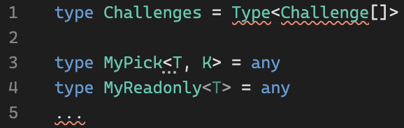

I am fan of [Typescript](https://www.typescriptlang.org/) since my last work at Yandex

Since TypeScript can be easy 😌 and difficult 😰 depending on your requirements, I decided to post the solution and the concepts behind every task I solve.

I take the challenges from [type-challenges](https://github.com/type-challenges/type-challenges)

## easy

- [4 • Pick](https://github.com/type-challenges/type-challenges/blob/master/questions/4-easy-pick/README.md) - [Pick under the hood](/2021-04-05-pick-under-the-hood/)
- [7 • Readonly](https://github.com/type-challenges/type-challenges/blob/master/questions/7-easy-readonly/README.md) - [Readonly under the hood](/2021-04-06-readonly-under-the-hood/)
- [11 • Tuple to Object](https://github.com/type-challenges/type-challenges/blob/master/questions/11-easy-tuple-to-object/README.md) - [Making object out of tuple](/2021-04-07-making-object-out-of-tuple/)
- [14 • First of Array](https://github.com/type-challenges/type-challenges/blob/master/questions/14-easy-first/README.md) - [Infer first element](/2021-04-08-infer-first-element/)
- [18 • Length of Tuple](https://github.com/type-challenges/type-challenges/blob/master/questions/18-easy-tuple-length/README.md) - [Infer length](/2021-04-09-infer-length)
- [43 • Exclude](https://github.com/type-challenges/type-challenges/blob/master/questions/43-easy-exclude/README.md) - [Exclude under the hood](/2021-04-12-exclude-under-the-hood)
- [189 • Awaited](https://github.com/type-challenges/type-challenges/blob/master/questions/189-easy-awaited/README.md) - [Unwrapping the Promises](/2021-04-13-unwrapping-promises/)
- [268 • If](https://github.com/type-challenges/type-challenges/blob/master/questions/268-easy-if/README.md) - [Boolean conditional statement](/2021-04-14-boolean-condition/)
- [533 • Concat](https://github.com/type-challenges/type-challenges/blob/master/questions/533-easy-concat/README.md) - [Spread in Tuple types in TypeScript](/2021-04-15-spread-in-tuple-types-in-typescript/)
- [898 • Includes](https://github.com/type-challenges/type-challenges/blob/master/questions/898-easy-includes/README.md) - [Includes in TypeScript](/2021-04-16-includes-in-typescript/)

## medium

- [2 • Get Return Type](https://github.com/type-challenges/type-challenges/blob/master/questions/2-medium-return-type/README.md) - [ReturnType under the hood](/2021-04-19-return-type-under-the-hood/)
- [3 • Omit](https://github.com/type-challenges/type-challenges/blob/master/questions/3-medium-omit/README.md) - [Omit under the hood](/2021-04-21-omit-under-the-hood/)
- [8 • Readonly 2](https://github.com/type-challenges/type-challenges/blob/master/questions/8-medium-readonly-2/README.md) - [Partial Readonly](/2021-04-23-partial-readonly/)
- [9 • Deep Readonly](https://github.com/type-challenges/type-challenges/blob/master/questions/9-medium-deep-readonly/README.md) - [Recursive Readonly for objects](/2021-04-25-recursive-readonly-for-objects/)
- [10 • Tuple to Union](https://github.com/type-challenges/type-challenges/blob/master/questions/10-medium-tuple-to-union/README.md) - [Making union out of tuple](/2021-04-27-making-union-out-of-tuple/)
- [12 • Chainable Options](https://github.com/type-challenges/type-challenges/blob/master/questions/12-medium-chainable-options/README.md) - [Mapped types in functions](/2021-04-28-mapped-types-in-functions/)
- [15 • Last of Array](https://github.com/type-challenges/type-challenges/blob/master/questions/15-medium-last/README.md) - [Infer last element](/2021-04-29-infer-last-element/)
- [16 • Pop](https://github.com/type-challenges/type-challenges/blob/master/questions/16-medium-pop/README.md) - [Manipulation with Tuple elements](/2021-05-01-manipulation-with-tuple-elements/)
- [20 • Promise.all](https://github.com/type-challenges/type-challenges/blob/master/questions/20-medium-promise-all/README.md) - [Promise.all under the hood](/2021-05-04-promise-all-under-the-hood/)
- [62 • Type Lookup](https://github.com/type-challenges/type-challenges/blob/master/questions/62-medium-type-lookup/README.md) - [Extract under the hood](/2021-05-06-extract-under-the-hood/)
- [106 • Trim Left](https://github.com/type-challenges/type-challenges/blob/master/questions/106-medium-trimleft/README.md) - [Trim Left in TypeScript](/2021-05-10-trim-left-in-typescript/)
- [108 • Trim](https://github.com/type-challenges/type-challenges/blob/master/questions/108-medium-trim/README.md) - [Trim in TypeScript](/2021-05-11-trim-in-typescript/)
- [110 • Capitalize](https://github.com/type-challenges/type-challenges/blob/master/questions/110-medium-capitalize/README.md) - [Type Aliases for String manipulation](/2021-05-14-type-aliases-for-string-manipulation/)
- [116 • Replace](https://github.com/type-challenges/type-challenges/blob/master/questions/116-medium-replace/README.md) - [Replace occurrence in a string in TypeScript](/2021-05-17-replace-occurrence-in-a-string-in-typescript/)
- [119 • ReplaceAll](https://github.com/type-challenges/type-challenges/blob/master/questions/119-medium-replaceall/README.md) - [Replace all occurrences in a string in TypeScript](/2021-05-22-replace-all-occurrences-in-a-string-in-typescript/)
- [191 • Append Argument](https://github.com/type-challenges/type-challenges/blob/master/questions/191-medium-append-argument/README.md) - [Append argument to a function in TypeScript](/2021-05-23-append-argument/)
- [296 • Permutation](https://github.com/type-challenges/type-challenges/blob/master/questions/296-medium-permutation/README.md) - [Permutations in TypeScript](/2021-05-30-permutations-in-typescript/)
- [298 • Length of String](https://github.com/type-challenges/type-challenges/blob/master/questions/298-medium-length-of-string/README.md) - will be added on May 13, 2021
- [459 • Flatten](https://github.com/type-challenges/type-challenges/blob/master/questions/459-medium-flatten/README.md) - will be added on May 14, 2021
- [527 • Append to Object](https://github.com/type-challenges/type-challenges/blob/master/questions/527-medium-append-to-object/README.md) - will be added on May 17, 2021
- [529 • Absolute](https://github.com/type-challenges/type-challenges/blob/master/questions/529-medium-absolute/README.md) - will be added on May 18, 2021
- [531 • String to Union](https://github.com/type-challenges/type-challenges/blob/master/questions/531-medium-string-to-union/README.md) - will be added on May 19, 2021
- [599 • Merge](https://github.com/type-challenges/type-challenges/blob/master/questions/599-medium-merge/README.md) - will be added on May 20, 2021
- [610 • CamelCase](https://github.com/type-challenges/type-challenges/blob/master/questions/610-medium-camelcase/README.md) - will be added on May 21, 2021
- [612 • KebabCase](https://github.com/type-challenges/type-challenges/blob/master/questions/612-medium-kebabcase/README.md) - will be added on May 24, 2021
- [612 • Diff](https://github.com/type-challenges/type-challenges/blob/master/questions/645-medium-diff/README.md) - will be added on May 25, 2021
- [612 • AnyOf](https://github.com/type-challenges/type-challenges/blob/master/questions/949-medium-anyof/README.md) - will be added on May 26, 2021
- [612 • IsNever](https://github.com/type-challenges/type-challenges/blob/master/questions/1042-medium-isnever/README.md) - will be added on May 27, 2021
- [612 • IsUnion](https://github.com/type-challenges/type-challenges/blob/master/questions/1097-medium-isunion/README.md) - will be added on May 28, 2021
- [612 • ReplaceKeys](https://github.com/type-challenges/type-challenges/blob/master/questions/1130-medium-replacekeys/README.md) - will be added on May 31, 2021

## hard

- [270 • Typed Get](https://github.com/type-challenges/type-challenges/blob/master/questions/270-hard-typed-get/README.md) – [Advanced Typed Get](/2021-03-26-typed-get/)

Will be added more solutions after May 31, 2021

## extreme

Will be added after June 19, 2021
