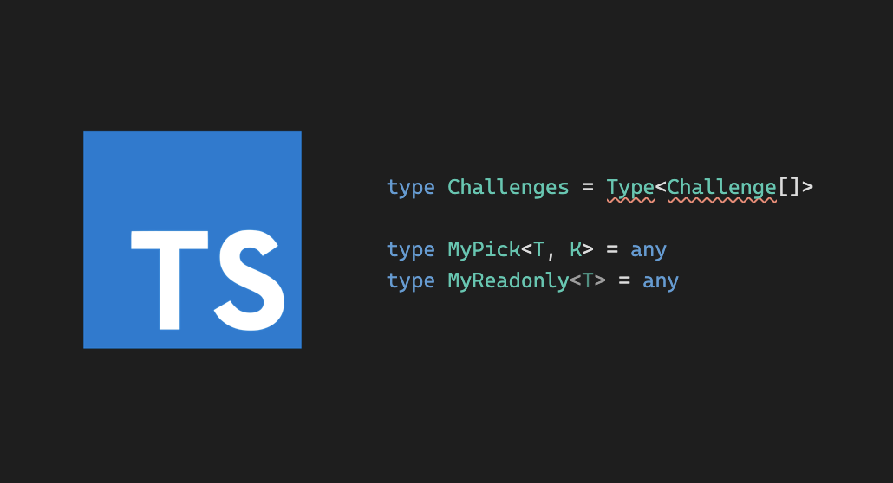

I am fan of [Typescript](https://www.typescriptlang.org/) since my last work at Yandex

Since TypeScript can be easy 😌 and difficult 😰 depending on your requirements, I decided to post the solution and the concepts behind every task I solve.

I take the challenges from [type-challenges](https://github.com/type-challenges/type-challenges)

## easy

- [4 • Pick](https://github.com/type-challenges/type-challenges/blob/master/questions/4-easy-pick/README.md) - [Pick under the hood](/2021-04-05-pick-under-the-hood/)
- [7 • Readonly](https://github.com/type-challenges/type-challenges/blob/master/questions/7-easy-readonly/README.md) - [Readonly under the hood](/2021-04-06-readonly-under-the-hood/)
- [11 • Tuple to Object](https://github.com/type-challenges/type-challenges/blob/master/questions/11-easy-tuple-to-object/README.md) - [Making object out of tuple](/2021-04-07-making-object-out-of-tuple/)
- [14 • First of Array](https://github.com/type-challenges/type-challenges/blob/master/questions/14-easy-first/README.md) - will be added on April 07, 2021
- [18 • Length of Tuple](https://github.com/type-challenges/type-challenges/blob/master/questions/18-easy-tuple-length/README.md) - will be added on April 08, 2021
- [43 • Exclude](https://github.com/type-challenges/type-challenges/blob/master/questions/43-easy-exclude/README.md) - will be added on April 09, 2021
- [189 • Awaited](https://github.com/type-challenges/type-challenges/blob/master/questions/189-easy-awaited/README.md) - will be added on April 10, 2021
- [268 • If](https://github.com/type-challenges/type-challenges/blob/master/questions/268-easy-if/README.md) - will be added on April 11, 2021
- [533 • Concat](https://github.com/type-challenges/type-challenges/blob/master/questions/533-easy-concat/README.md) - will be added on April 12, 2021
- [898 • Includes](https://github.com/type-challenges/type-challenges/blob/master/questions/898-easy-includes/README.md) - will be added on April 13, 2021

## medium

Will be added after April 14, 2021

## hard

- [270 • Typed Get](https://github.com/type-challenges/type-challenges/blob/master/questions/270-hard-typed-get/README.md) – [Advanced Typed Get](/2021-03-26-typed-get/)

Will be added more solutions after May 14, 2021

## extreme

Will be added after June 02, 2021
