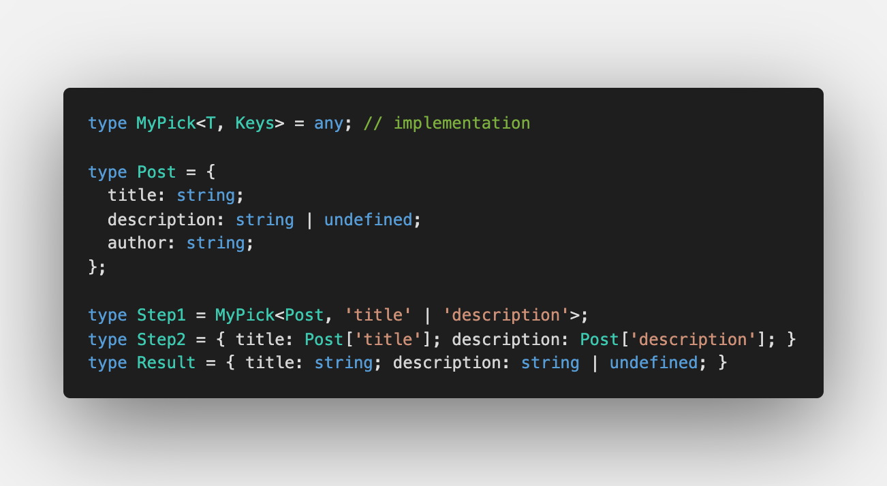
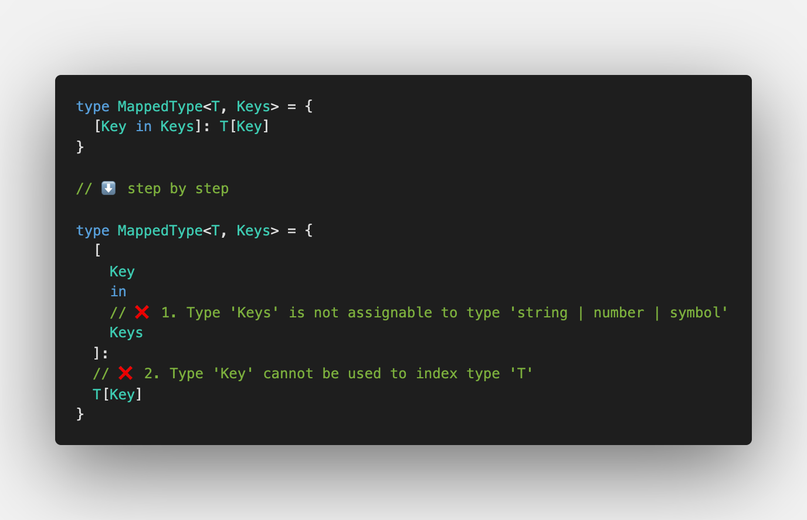

First challenge is [Pick](https://github.com/type-challenges/type-challenges/blob/master/questions/4-easy-pick/README.md)

It's usually used when you need to declare the type which is based on another type. And you know in advance which keys are included.

## Iteration over an object

First, you need to iterate over an object `T`. Usually [Mapped Types](https://www.typescriptlang.org/docs/handbook/2/mapped-types.html) are used in this case:

- `keyof T` gets the keys from the object `T`
- `in` is for iteration over the keys
- `Key` is a key itself
- `T[Key]` is a value for a specified Key

## Specify `Keys` to iterate over

Second, to iterate over the part of an object, we need to specify `Keys` to iterate over:

But with this you have 2 errors:

1. `Type 'Keys' is not assignable to type 'string | number | symbol'`
2. `Type 'Key' cannot be used to index type 'T'`

Both errors are connected with the rules of the iteration:

1. Key can be `string`, `number` or `symbol`
2. We cannot call `T[Key]` if `Key` doesn't exist in `T`

If **rule 2** is true, **rule 1** will be true as existing keys are one of the specified types. To iterate over the existing keys, we need to apply [Generic Constrains](https://www.typescriptlang.org/docs/handbook/2/generics.html#generic-constraints) using `extends` keyword.

This way, if we specify non-existing key, TypeScript will throw an error `We cannot call T[Key] if Key doesn't exist in T` so we're safe now ✅

Check out the solution in [Playground](https://www.typescriptlang.org/play?#code/PQKgUABBAsELQQAoEsDGBrS8491gRgJ4QCCAdgC4AWA9mcQGICuEAFAAICGlAZkwJQQAxAFNOAZ2JCmZZHWH4myADYU4yMlixCdEAIpMR4inM1QsASQC2AB2UirIyhGoiIilWo0QABigwAPAAqADQQANIAfD4QAOZOIgBOaBAA7sjUNEwUEEziGrEQGQB0WlAAwnTGiUyoFOIQnC6ENm5EEDZo6AUuVG7iIjk0PB2JNK2JJka+4TE8Y1a+QT5lEAw0iRAiAB6ctvarPkf1WBoUSTycqG5BNAAmNBAA3lhQJhT2AFwQ1QWvEHcjKhkjYTHRvr8yLF-qgaPtBiI7t98DQaPZuFgAL6rCgtG73GiIRIiABuyBEqQgAF4IABZQj+dDBAlhADk73srIgAB8IKzYfDzndWZFVrCyMYXATvrcHkTSeTKTSXlBVS4Ml8+eV0WQIGM4ayQv8oAK7AikRBLsoBkaoNioEcVuYoJEIAA1RUQeQAcQyAAkmPhvlQKBQbOJPsBgPVUFRigArcTFDaxYDQMAgYBgbOgCAAfQLhaLhYgAE0sptKoCIH6km5iw2CxBM9nca06QyusEwuERIQGjtzmQ7g10H3hhAgq7lVgANq94jeBfiAC6MvnfZXYGxOZA+cbxcnRhy5Qk0wPh5byFsGxyTwgAFEAI5MTjKMIP7atOoQTGWhZ8uwbYiHAsZvvYUJGMA2QqOIrKtniECoGeDQ0rOWCft+FABM+r7KDhX4iHUiIAIxhPSjLMg8bIciIIqRJEtqPoRdQ4S+b4EVhiIAEzkZ2gSyjQNEanRPJ8qa9hCvRjFYFGEBAeIcA7FhSmJGMiRYBRXaCcJHyiby-JwmaUliayGgkm+yDCjJW5gGcFxXPiDzPFgtEQhQyRQlggLiMCyCgqY7medCJpGZJiLIqiOrbtm9mJJc1zMVxdwkS5bwiUFfw7nFCVuJhRFCtxaXqnpmVeaFgoRe4UViJoO67vuF5Nswkx9JsADK5zho1TXNlmoBYK67VUJwxIQIQFY-GiMFVMGobhpG0a+XGibJokqbQMA3DiKkSSDe6nriNNYISnNYYRlGMYrUmKZpsAR3KDNEr7bSGxuOUI3KBB8QRhAIbnYtV0Jjd60ZlmYBAA) ⭐️
