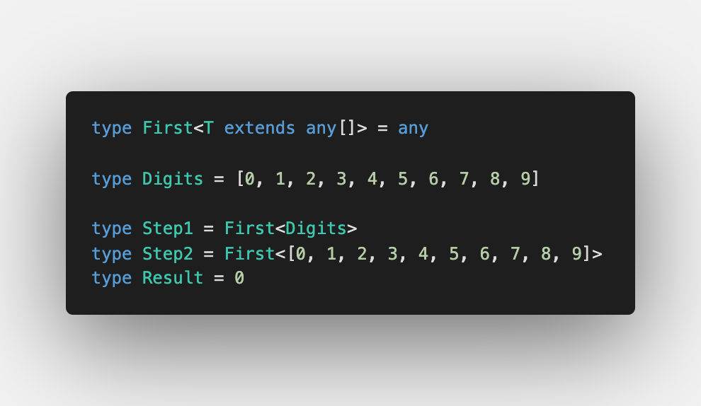
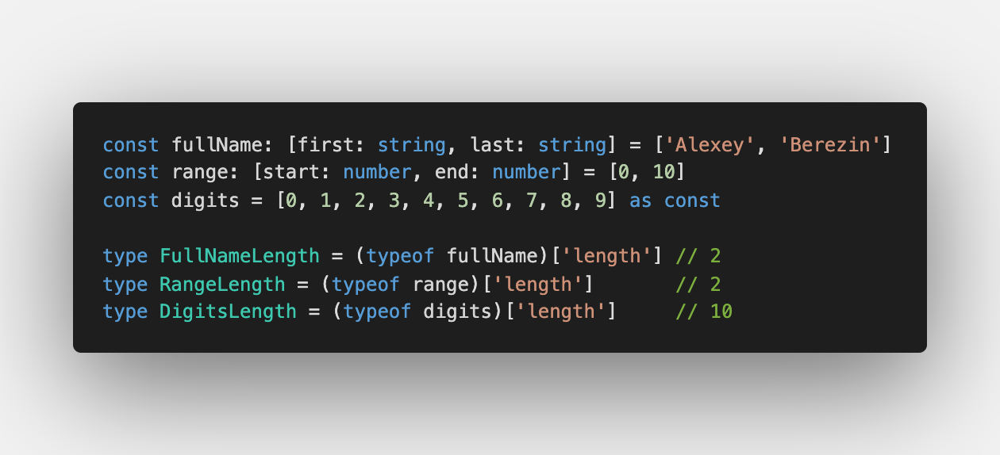
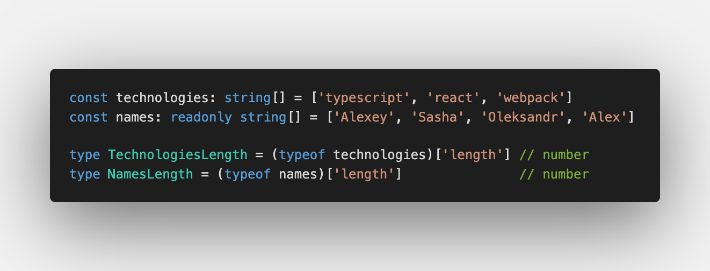
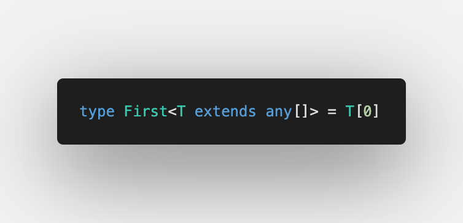

Fourth challenge is [First of Array](https://github.com/type-challenges/type-challenges/blob/master/questions/14-easy-first/README.md)

Here you can use it for tuples and arrays. But for tuples you get exact value.

## An array or a tuple?

What is the difference between [arrays](https://www.typescriptlang.org/docs/handbook/2/everyday-types.html#arrays) and [tuples](https://www.typescriptlang.org/docs/handbook/2/objects.html#tuple-types)

TypeScript defines [tuple](https://www.typescriptlang.org/docs/handbook/2/objects.html#tuple-types) as:

> A tuple type is another sort of `Array` type that knows exactly how many elements it contains, and exactly which types it contains at specific positions.

It means we can check `length` and will get the exact number:

[Arrays](https://www.typescriptlang.org/docs/handbook/2/everyday-types.html#arrays) cannot do that as you see:

## Extracting first element

Previously we described [how to iterate over tuples](/2021-04-07-making-object-out-of-tuple/#iteration-over-tuple)

Here we don't need it as we can access index directly using `[0]`:

But don't forget about [Generic Constrains](https://www.typescriptlang.org/docs/handbook/2/generics.html#generic-constraints) using `extends` (it's already added)

Great! ✅

If you interested in test cases, please have a look at [Playground](https://www.typescriptlang.org/play?#code/PQKgUABBCMAsEFoIDECWAnAzgFwgewDMIBBddAQwE9JEE76aAjSkgO2wAs9WXkBXCAAoAAuXYE+ASggBiAKblMLGeTJUaNGVogBFPnJypuGqAEkAtgAcANnPNz2EchADmDuelQBjCAAM0WNgAPAAqAHy+EJzkuNjkANYGTqwkaiy+IZFiACYQ6HLYfOismBCo2ADkpQQYOBBytvbsVVGUlnIAdCYoeOj1AB7kVrbdvmPYmDTYbXJOZNAQALwQANoV5BUANBAVjFs7XhUAulMzc+gATEurAMzbF9vQJ1Cn7RAcCtkLywE4QaroaBhCDAYADdpebByXLYPAQRizdYVV6zD7kbJXH61YIAi7A0HguSQ6FROEIiA3GhjXzdYEANVQcgA7vgUgBxcoACT4jAAXO9sNhLJheaCJl4OB0AFaYDq9FzAOBgEDAMBq0AQAD62p1up1EAAmngihAAMJ4bKzTkeWZ6u3aiAqtXTN6-YIhAZQ1jZUpiSgrI7A5YhFYABhO6pAWvteogIQMuFNiiSMdjTtQVl6uAA3hAAKIARz45Gs2zz-QhuAAvhACOg8OYdsIXXIEBKS7ZWG5MMA+NhUNZMMiwC2IF5k6VlisaOXK0FC8XrEE3UEVncIA8YIHtjcwmFNjOK0TgguS8vsavBNJFsDoBd17nyPycJ4uxAq9uhNfb-e9weoLOx7zkWZ4rgG+4QKwcgAG4eH+h5zqeS5gXw3pyDUUHZJ+qGWhh0J7mAEaRtGqYOvw6CcB4EAAMpQsKJGkY6qqgDQwLURwqizJQxp9JgeDWH2RglPyHCCsKorAOKkoynK6AKnAwBiJgTIeKxEAMsyEB8QJ-bcCKApCiKYqYBK0qyvKiqwMA2mCXpakALK9LMpocdYnbdiJYlGZJJnSeZcnKqqYBAA)
