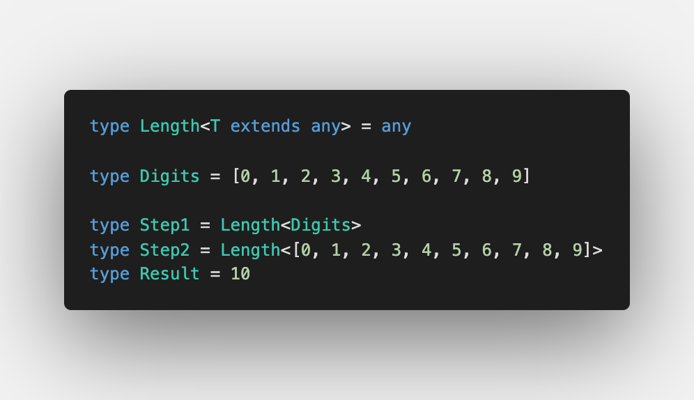

Fifth challenge is [Length of Tuple](https://github.com/type-challenges/type-challenges/blob/master/questions/18-easy-tuple-length/README.md)

As for [First of Array](/2021-04-08-infer-first-element/), we can use it for both arrays and tuples, but for tuples you get exact value.

## Extracting length

When we distinguished arrays from tuples in [Making object out of tuple](/2021-04-07-making-object-out-of-tuple/#an-array-or-a-tuple), we have seen that we can call `['length']` in types which is really convenient. Let's try this:

As usual, for calling tuple methods in types, we need [Generic Constrains](https://www.typescriptlang.org/docs/handbook/2/generics.html#generic-constraints)

For that we used `extends readonly any[]` constrain.

If we try `extends any[]` instead, we would get an error for `typeof tesla`:

`The type 'readonly ["tesla", "model 3", "model X", "model Y"]' is 'readonly' and cannot be assigned to the mutable type 'any[]'`

It explains itself: we should expect accepting `readonly` types.

Nice 💫

To try it out, please have a look at the [Playground with tests cases](https://www.typescriptlang.org/play?#code/PQKgUABBCMAcEFoIBkCmA7A5gFwBYQHsAzCAFQFcAHAG1UkQUafoCMBPCAZwEt0CD0EABQABHnwEBKCAGJUAQ04cZ2KrXr0ZWiAEVyqTtm4CNUAGIEAThEzcAbhgjyIqmqgA0ENgXIR0qVAATCABjSwVsVCcbDFRLbhCIAAM0LDwkz0oEgGsXXCjaNPxiPKjXdSh6C2tUAA95AFs3U2SkpOxOemw2SjKDamcAXggAbQBySM4Bsc8xhoJA1GoIAGYZiDmFpYgADXXNxeWATTGAXS6eqM5KeRDUHYhh8bMAQWQAYQB5ADkIAE59q8Pj8IAAJACiLwAaidZgARABKLwA4j99gBlUgvBHo0EASQACvtQQBVACyL1+6IJL3e4LMyDxyNBpDOLW6vRc-XkqRw+GGvLwAB5JgMAHxQYDACB1XohSLBAAsF0511u90F-JQGD5QrVdx2EqlMtqcoVEAArPQ2kkWhKodxUAB3QiCZHcbCg8gsABcEFw2GwlE4PqlHRCuAAdAArTiRqyYYBwMAgYBgdOgCAAfRzubzuYgRx81neWzBcSi+arOYgqfTHKimqFpBNkXQgU4TnQbBGpwlw1I40KfLZYEz1arZAM2Ag70UBmzE7ztbT3CaVhnAG8IOCAI7keTUTzg02oeUQAC+ECIlgIDQ2IgbCAjh+HBmA5CM1E4Y3TIQEhhclMQyjBM3L7PMhyrBBWzLHssyQdsJynE4nb-ughhgOhgH6vcjygUCXy-ACsyESCELQrCGyIiiaKzJi2K4oSxLkpSEDUrS9KMsyrIoYooQAdg9aXKE86dk89AnmaQp7ge1BCk2DYlKK8hip4ipimpkmnvKMn7oeCk6sKSkkLhhqeBamnuGA5zpmOICLkuNZmOQlh4HE7GRMGjlOSu9n0BK6K4PI4ReMWXAENQn7GBhfoBkGIZhpwEYxnGCZJrAwDyBhTpxAFEAOs6EVRUYAFxYGwahsA4ZRrG8aWImcDAJwkXRQB+VklYUTvMF1BviG-oVYl1XJbVaUNSmaZgEAA)
