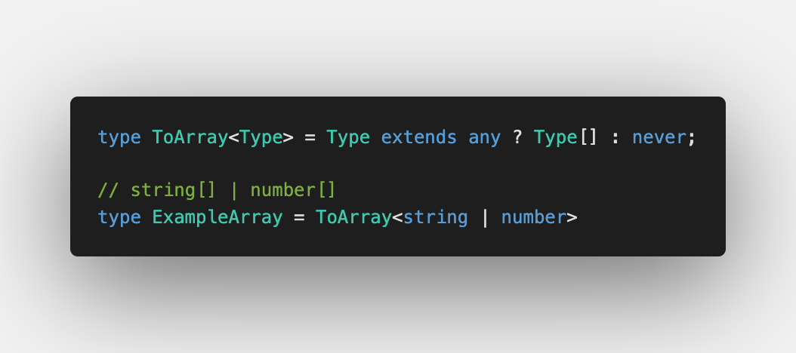
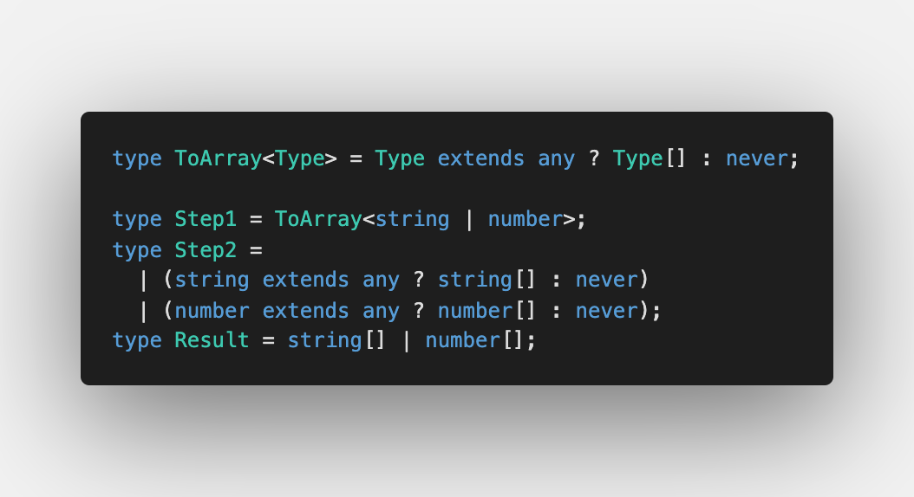
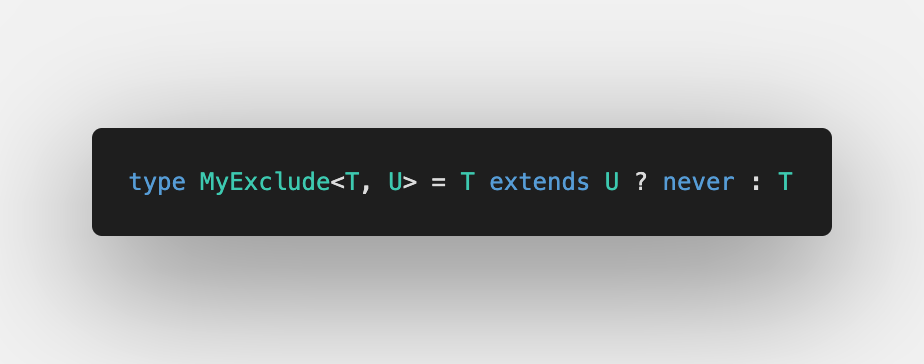

Sixth challenge is [Exclude](https://github.com/type-challenges/type-challenges/blob/master/questions/43-easy-exclude/README.md)

Don't mix up `Exclude` with `Omit`:

- `Exclude` is used for [union types](https://www.typescriptlang.org/docs/handbook/2/everyday-types.html#union-types)
- `Omit` is used for [object types](https://www.typescriptlang.org/docs/handbook/2/objects.html) so you can remove specified keys within it

## Iteration over a union type

We already know how to iterate over:

- Object types (see [Pick under the hood](/2021-04-05-pick-under-the-hood/#iteration-over-an-object))
- Tuple types (see [Making object out of tuple](/2021-04-07-making-object-out-of-tuple/#iteration-over-tuple))

For union types there are [Distributive Conditional Types](https://www.typescriptlang.org/docs/handbook/2/conditional-types.html#distributive-conditional-types):

Let's check what's going on step by step:

So it's literally applied to each element of a union type 💫

We can use [Distributive Conditional Types](https://www.typescriptlang.org/docs/handbook/2/conditional-types.html#distributive-conditional-types) with different conditions:

1. `Type extends any`
2. `Type extends unknown`
3. Reversed `Type extends never` (as this is `false` for every `Type`)

It works the same way because `any` and `unknown` are top types in TypeScript and `never` is bottom type.

## Solution

For `Exclude` we want to do the same way but we need to remove specified elements from a union:

`T extends U` is what we need:

🔥🔥🔥 Great job!

Please check out the solution with test cases in [Playground](https://www.typescriptlang.org/play?#code/PQKgUABBAsDMEFoIFEAeBjANgVwCYFNJEETSiAjATwgC0ALfRgOwHMIAKAAQC8HmWAlBADE+AIYBnasPLYAlpgAuCOUyJFhmiAEVs+CYrkB7NVCIBJALYAHTPkv4miiIoYRZC5apQYcBADwAKgA0EACqAHxEET5YePgQAGYATkaWEIEudEYSCYqU1vpZYs5iyQmSEnIsTGLkdi5G4epQMQBqcvgA7hAmEADicooAEtjkAFwQdIqK1hLjwMCKEuh0AHQAVhJrRskswHBgIMBgp6AQAPpX1zfXEACaRtjJEADCRgQQw-jll7f-Fwgx1O+UKEAAspQ0HEAiFwjEALwZCD4VCKRy4CThCAAfggTHwADcfhBJoEANxnEB-AE3DL6ZyvSRFWm3IEnOQ2XbOADeKAAjtgxJhQmhCuhFKLUOLFAAxYW5UIAOSMimQguFEAAvklUukAOScUH4BCrYV2Vj6YDYQyYCT6kEFBLoZlYpEAbSIUDF+Al-nVQsw-kh0L8+H8ACIxBGIAAfCAR8gx+MR9AR0JRiMRKUw8OZuMJpMF1PphPRiIV4Jenwy-0aoMh3zxSPR4tFlNpjOtlNJ7OxMMt5OFoclrsj3uV6s+v0B4XBqFNgIGZKqNjxpjYSzkEnx9jsIQImKEoxyXACUKy7BMCXGJh90PN5ergsbrc7jj7iCHiDH0-niCXtehgmBW2ZgAAuqcVI0qygKXskrgkgAyuicwway7JgKA0QQEhdBlAklBPC8EhGDgwFMPMUwzHMCxLCs6xbDsewHLAwBiJRXQ-DhHTdBApHkbeVHTLM8yLMsqybNsuz7HAwACTaQk4eCuwJK8+GYBaLD6JMIm0eJDFScxLBHCcYBAA)
