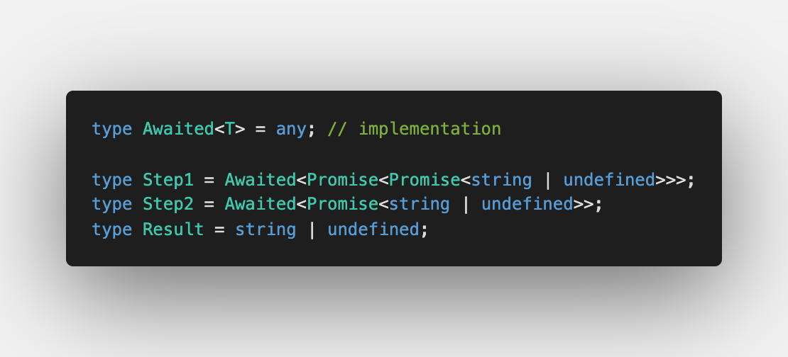
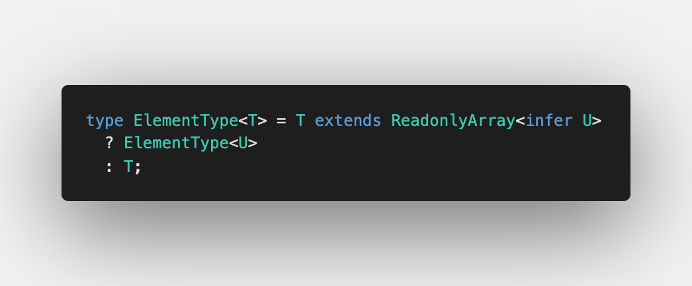

Seventh challenge is [Awaited](https://github.com/type-challenges/type-challenges/blob/master/questions/189-easy-awaited/README.md)

Like `await` in JavaScript, it unwraps `Promise` and gets the value in the same way.

Sometimes it's useful to get the value even if it's double wrapped with `Promise` so this is also possible.

## Unboxing values from types

[Type inference in conditional types](https://www.typescriptlang.org/docs/handbook/release-notes/typescript-2-8.html#type-inference-in-conditional-types) is defined in TypeScript as following:

> Within the extends clause of a conditional type, it is now possible to have infer declarations that introduce a type variable to be inferred. Such inferred type variables may be referenced in the true branch of the conditional type

As we want to unbox double or maybe thrice wrapped `Promise` we need [Recursive Conditional Types](https://devblogs.microsoft.com/typescript/announcing-typescript-4-1/#recursive-conditional-types):

It's available since [TypeScript 4.1](https://devblogs.microsoft.com/typescript/announcing-typescript-4-1/) and allows us to do so with `Promise` too:

This is it ⭐️

Don't forget to check the solution on [Playground](https://www.typescriptlang.org/play?#code/PQKgUABBCMAcCcEC0ECCB3AhgSwC4FMATSZJM8kgIwE8IBZTAY23wCsIBlbAawHsAnTBAAUAAQC2TFqwDOPAZgCUEAMT5MM2ioAO-XuOwz8JEirMQAigFd8M3Nl4A7E1ACSAMwjp8EABaYANx8hXGptH3RfbEZfCEMvQW1wwghQ8IgAGx4fAAU9AyMAOggACV50Lx9GTEcIAHN8XAgQsIiomLiZOMc5Qh9cXwjE5NTWgH4IADEBCHwAD0xxbQyfbE9vP0CfAAM8-UN8AB4AUQWllYAVVoA+bb9y1N56xohTxeX8K-CxlwhriAuUS6AEcbHYHLV4toBAQUu58qlBhAANoCbB1bCOTAZZr8eyMFYAXWEvlwuG0MgAXMBgH0AoVcLxgJJGHI+IJgJhCAEaowiEg0rZGPxsNpcEh5vh+MwjDIkKDbPYnEhoEgACwAVm4auUNBREikbDZCmJpPJVJpGIGVkohUY+mZhtk8kEil+-wAaiwKk4IABxPAlG2UvxkinU4C4GQxQqyQoCOrAODwMAgYBgDOgCAAfVzefzeYgAE1eFZ+BAAMK8PqlKU+AsN3MQNMZwVoLB4IiHC7-AC8ANmcwIjkIXT2BSOmPcUogAFVriQJhgcLDDvOSCGLgBuTMgHONgsAxWVjS2fcHwst7BLGEQADer1B2IANK85uFGE0AL4QeH6CAAOSiIKSAxNiKyOA0MjAFY9gZDIAGtq0EAABoQP244HIcdgipBC5tkW6EQJhRiHA+7gsBkhAho4VjiJQM5fguYBttUspEciJCnB+uAnE+GSHMunaEIcKHXK+OGYnU1ziVx774J+fFWNigkdquRbifev6UdREC0fRjEyc+YCEhmu7nhe2ZTGWAwzhwBAUhZF7NumoAkP8HD+PwPjUKW5YyLwGSwRCVKhuaEZRjGcYJkmCCcj03j8O5EBevgFQBUFSo9CGZrhjSkW+LGMjxvwibJsAGXBU4MjJXQAg+BW-gZBBUE5WGFqRtGhXRaVqbpmAQA) 🚀
