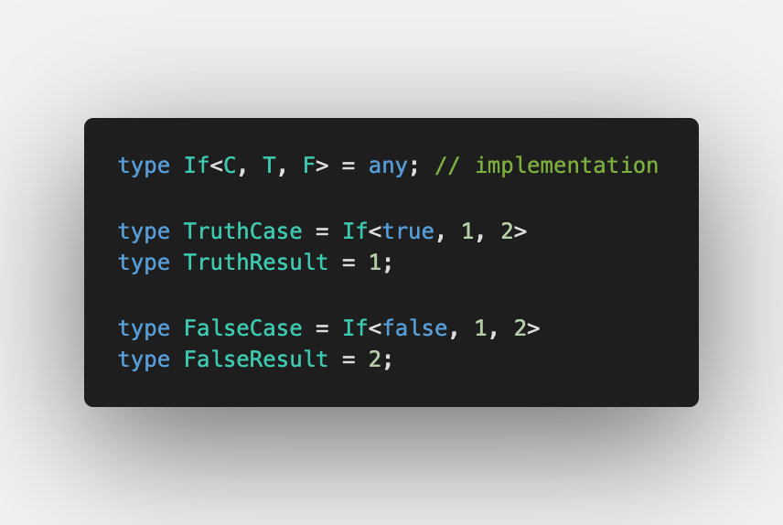
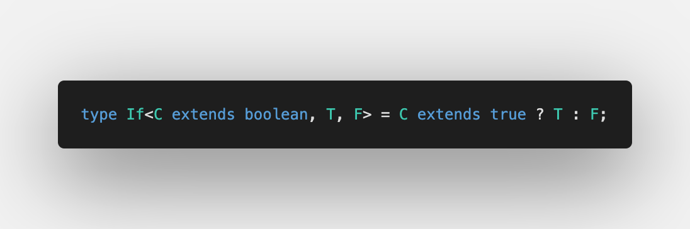

Eighth challenge is [If](https://github.com/type-challenges/type-challenges/blob/master/questions/268-easy-if/README.md)

It is common to use conditional statement to get either of branches. Like [conditional, or ternary, operator](https://developer.mozilla.org/en-US/docs/Web/JavaScript/Reference/Operators/Conditional_Operator) in JavaScript.

## Checking if the value is true

[Conditional types](https://www.typescriptlang.org/docs/handbook/release-notes/typescript-2-8.html#conditional-types) are what we really need:

Also I added `C extends boolean` so we are always sure that we only have `true` and `false` ⭐️

If you interested in test cases, please have a look at [Playground](https://www.typescriptlang.org/play?#code/PQKgUABBBMBsAcEC0ECSAzSyk91gRgJ4QAKAhgG4CmANhAOI0CuAzgBYDWA9hRABQABAA5l2TAC4cAlBADEVUcVkSAljRZYss7RACKTKi3EquAO01RUAWyE0qVqqfEQyEVeogADDJ4gB3NhUAYzYXIKCqIXEWCCCzABMVYzMvAGFPABoXCHEAJwk2YlyqcSZc0xzCISovABVMl1N47PQydSKSsorxKprPADFPADo03xUYqgAPaqDxKmbxLgh8GqoktipcrzyDXy4tz1b1Kl8AtT76xuaB3yCyCpXG4h7qoYsIfv2IKbIbOwAud6eYHRLAvGoAQQgAF40OgADw7KhZADkZBRqPwKIAfFBgMBvtMqLN5jklo80Siwb0IAAhGFw+FHFjIiCUzE4iD4wkzOYLck1FFYrDAzzvXEANRUVD8EBS9CSAAkmPh-hA2OJxEIWP98dEQkMAFYsIb7ADmwDg8DAIGAYHtoAgAH0Xa63a6IABNLhlCCpLjxGqKzY1d1hl0QW328GM1KEuZNGL4LhcOz3LK1LL9XGwuNTBPxGJIiAAfggtQgav6AG57WBHeGw+XDM5UqJDM7G27I3aVDZ9s4AN4QACiAEcmG0siOibMIABfCDoXJcKxsgTgpAhNp2UxmwzAdwsKlgGN3FkxWEAbSwM958PHk5o8IwiPyrPZbKx2NR6OxP9vWdxAfCc2hfBFmQ-dEsmgH8YH-DIwAAXQdAkNxYJApl5TDchXXJTxpTY8IZV9TCYGgaF-DEvxxOt6xATsuwjfoynEDYtgAZTmbVGKYnt6KwXEOLYMhiggQgfS2FhU1UMwdXVTVtV1YB9TYI0TXNS0EGAe4WD8TZBIgKUZQgaTmGSUx5I1LUdT1FgDWNU1cgtK1gDM2TLMMgBZfYalSESKMcfcrMU2yVPstTHPNG07TAIA) ⏯
