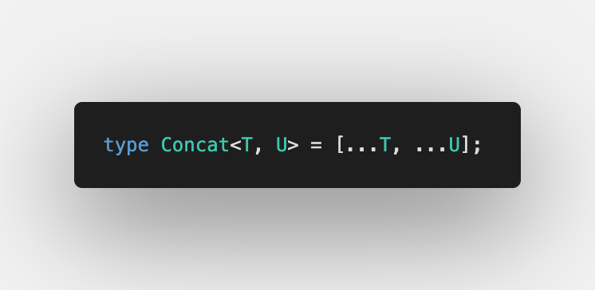
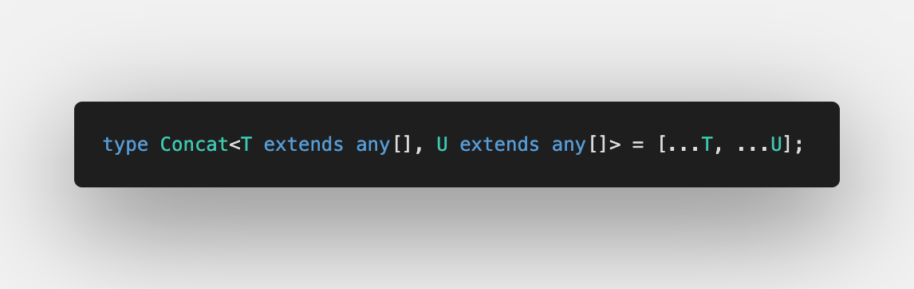

Ninth challenge is [Concat](https://github.com/type-challenges/type-challenges/blob/master/questions/533-easy-concat/README.md)

Sometimes it's useful to collect 2 tuples' elements in one tuple, like [Array.prototype.concat](https://developer.mozilla.org/en-US/docs/Web/JavaScript/Reference/Global_Objects/Array/concat).

## Using spread for Tuple types

2 changes were introduced in TypeScript 4.0:

1. [Variadic Tuple Types](https://www.typescriptlang.org/docs/handbook/release-notes/typescript-4-0.html#variadic-tuple-types)
2. You can use spread anywhere in a tuple, not just an end

So let's try it all together:

Here we have an error `A rest element type must be an array type`, let's add [Generic Constrains](https://www.typescriptlang.org/docs/handbook/2/generics.html#generic-constraints) to allow only arrays:

This is it 🚀

Don't forget to have a look at [Playground](https://www.typescriptlang.org/play?#code/PQKgUABBCsDMsQLQQMIHsB2BjAhgF0iUWJMICMBPCAQQwBMAnAUyoGkGcBnNAN04GsqACgACZZrAAM-DgDYAnFk4BKCAGImXKmpwMOFQoTXGIARQCuTTngCWmQ1ACSAWwAOAGybOmGPBDwAFkwQAFI4PDgAylgMNq5+AAbUejgUAHRYmLh4CRAAZubYtpgQNhj+Qf4UrsGcFNZeaTRVNf44-FYVwXgA7mgQugDm5t6+nE0AKpVo5niusxCcATPudBBkwTgQGEw9AylUgfil2O7mdJ1l83icJxDueAwQaAwXDA4QAGIvEEwAHjg3J4PglQTdCHhqsEAEpWcwPCAAXlQWXwAB4ANoARgAugAaCAYgBMOIAfBBgMBfn8alg8Ew1nh+htCViCSTCKCEh9yQA1Gy7Z7lADiNjwAAlzGQAFwQAJ4OacaWUm5YAJpABW4xeg2AcFgYBAwDAJtAEAA+pardarRAAJozJ7oC4QcVMZgWm1e80QI0myGtdDYdETan0+i3HAYCgY-EQACqYZ8dEj0dj5ORGLS2YmBOzaXjOIA3CawGbvV6IBMrH4UFxOhWbb7jTY3C8-ABvCAAUQAjuYcO4Cd2aUw6RAAL75BhoZwQADkIgDTEQasHngwgyswFmNncnHn-qhEFwnE6mcII9peDRfYH7jRQeymLj6YJ6dJeMvo7pt-7g8fVEb1jd9cU-VkyU-b9rz-e9AODYC2QgEl31gAkABYyVA9kCTQiBMNJKCoCvMcbzvACn3RDF5yxeccIXWB51fPJBzPAkyDQNBPCjAl53QpjwOo2j6PnRiCRY-cmHYzjuIwXj+Mgr8cVLMsQE9RtLS+cwGECd0IEielXFuDTbT9UBCHJSIAl0YIKEdRYuN3TAlTlBUjOVYBVXVLU0h1PV4GAKNOB6d0LIgflBW4M5igwFz5UVDyvM1bUGF1fVgCipzYrCgBZF5ghQaz3A3Lc4rcpUVU4NVkt81LDWNMAgA) ⏯
