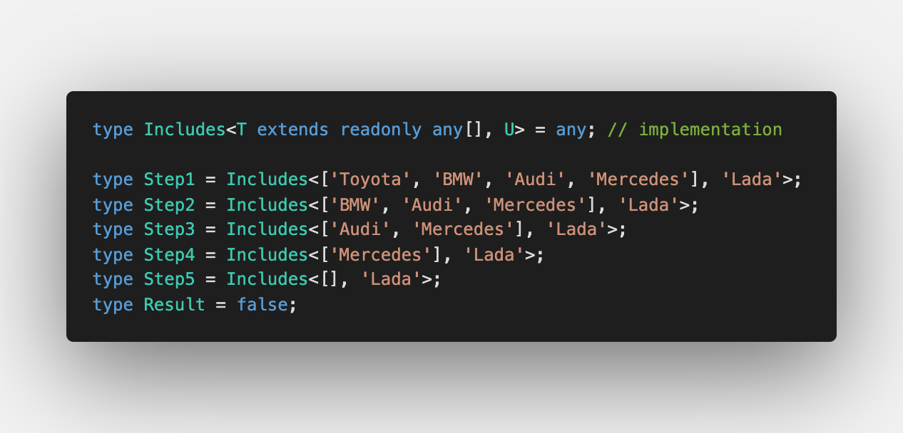
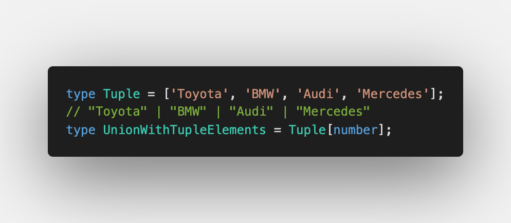
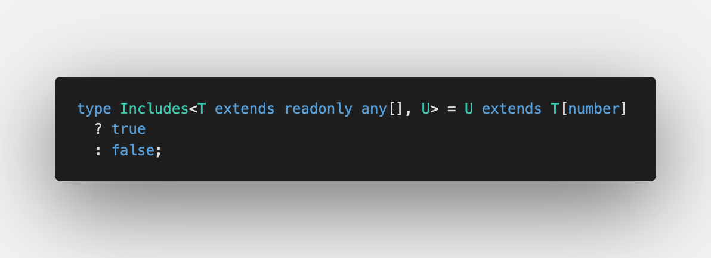

Tenth challenge is [Includes](https://github.com/type-challenges/type-challenges/blob/master/questions/898-easy-includes/README.md)

If you have a tuple and want to check if the specific value exists, this is a challenge for you.

## Iteration over tuples

Similar what we discussed in [Making object out of tuple](/2021-04-07-making-object-out-of-tuple/#iteration-over-tuple), we can use [Indexed Access Types](https://www.typescriptlang.org/docs/handbook/2/indexed-access-types.html) to get all the elements from the tuple:

Afterwards we make sure we have an element `U` in the union of all elements from the tuple:

The solution as always is available on [Playground](https://www.typescriptlang.org/play?#code/PQKgUABBAcCc0QLQQJIDsDGAbArgEwFMBnSJRci0gIwE8I0cssIAKAAQGsa0CAzHDgEoIAYgIBDInRHiATrPE1SpEaogBFHMQAuASwD2aZVBQBbAA5YCpgmm0RtACwIQAUuIBu4gMoZZu83sAAwBBeUUAOl1MXEIiIIh+TD1DCGiHZwcacxcpIm1rCIgQrJyHcQ5iDJdtAHd9CDkAcxwbOyIigBVM-Rxtcz6IIkderDwIKhdxCf19K3E0CCDtWS0E-Vkl3nEsIgIgiOMIADENiAIAD3ELKyOg++0SKG1sl10iAAVdJjkAWVsIABeVAxfDEAA8AG0AOQAaTkRGhABoINCAKJEXR4d66ZGogDq1xwODx0O8C20C3E0IAuijoQARAzQgB8EGAwHOFxyGAK420DUmWx2eyCpHuYqgpDZADVdARahBUgBxXTaAASOCoAC4II5tP0iNqOY8MI4IgArDobJrAODQMAgYBgF2gCAAfU9Xu9XogAE1epsAML6QgQdUEWQuH0xz0QJ0ul5ldDYMFEcGdLkFNB4IgQKPiPCGLB0BY0SF0iAAVTZwKrWdsuYgnUhDFMk1kNIgAH4HKsXLrtrsCABuV0gD2xn3NnQQIOSKpT6cJ3QWDb2ADeEDRAEccDsUWjuQReRAAL6JWT6UyothJgiIM07KxoJrEYB9b6IxOvCAYBd5sCkKkEePLaOCu77lg4IprEEIwvCsiIvSGJYjipKEqYxKkuSdhUrS9KIYiLIoisWgsiRIHHryEF7jsMGgnEUJwgiyLopi2KYmxmHYfSuGUmg1KVoyzIkYkIoEBRSJUWBtFQQxqZMZCACMKIAEwogAzCiACsKIAGwogA7JWAAsYlDnsUlgDSLrjpOS5xscOCyE4kYQN4BTmHmjm+gmoDSh5jhyC4NCBkMcyfoYRp6ga3nGsAprmlaEQ2na8DAAsRC1JGgVygqEW4CkaAxfqhoJUllrWrItr2sARCRcVTwQGyvwbC4QbBUwthvqVcVGiaRBmlVqU1Y6zpgEAA)
