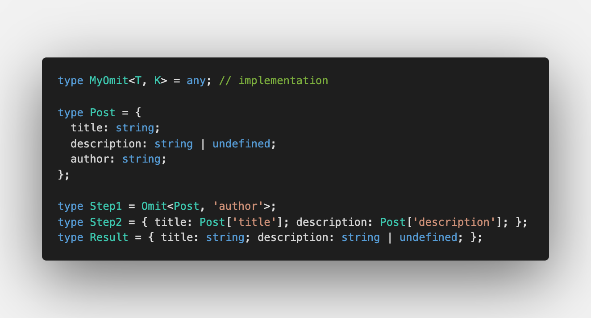
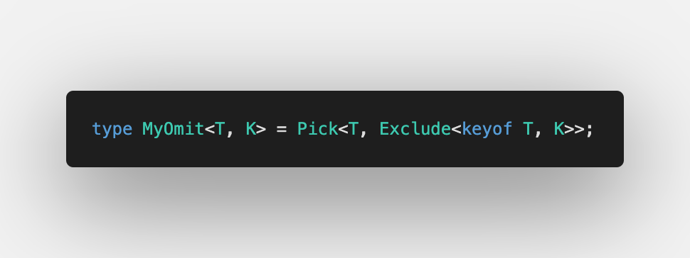

Today we're talking about [Omit](https://github.com/type-challenges/type-challenges/blob/master/questions/3-medium-omit/README.md).

First challenge was [Pick under the hood](/2021-04-05-pick-under-the-hood/) where we discussed how `Pick` is working. `Omit` is the opposite of `Pick`: it excludes the keys we specify.

## Combination of 2 challenges

First of all, we already learnt how [to pick the keys we specify](/2021-04-05-pick-under-the-hood/):

We also need [to exclude specified keys](/2021-04-12-exclude-under-the-hood/). That was in one of the challenges too:

We pick only those keys which are not excluded, let's use them together:

As usual, put the solution in [Playground](https://www.typescriptlang.org/play?#code/PQKgUABBDMELQQPIFsCWAXS8491gRgJ4QCCAdugBYD2ZxAYgK4QAUAAgIYUBmjAlBADEyAKYATVI2RDGZVLSH5GqADbo4qMliyDdEAIqMRAZ3TytULAElkABxUjRFCFREQlq9ZogADFBgAeABUAGggAaQA+HwgAcxEyEQAnVABjCAB3DBpGdAhGY01YiAwAOm0oAGFaUyTGVPRjCA4XQls3IghbNIBrIuaVFS6k6naksxMIbhHpHyCYrjEXSgSIJMdqADd+n3CfCoh6aiSIEQAPDjsHA59bxqxNdGTuDlS3IOoxaggAbywoMzoBwALggtSK-wgYhMqRStjMtFB4LIsUhqWoVxETzEoPw1GoDi4WAAvgd0G13p9qAAFdbbEQZCAAXggAFlCP50MEqWEAOTQ4yw1Dw8y8iAAHwgvMBDl5kQO6LIphcVNBHy+tJE9MZLL+UCg6Mx2NBLxUxhEIRJWFu+0sUEiEAAaqgGRAFABxDAACUY+FBlHQ6FsxmBwGAjVSlFKACtjKVjrFgNAwCBgGB06AIAB9HO5vO5iAATWojBO1WhEC9yTc+drOYgqfT5PabI5aC5oQiDpZ1N6wTCAFEzqkVIxoQEeiJCNRuBBO1FIgBudNgTN12tzkx5Socc1Ndf5htp1B2Y55H4QAcAR0YHBUg7O7QaEGJUxmUrYzZEcEjd4cKJMYBclUYxeSbCkIFSXdJhZABtLAhyfLlr1vFQAkQkQGnEABGMJ2U5bkvj5AUhRFWg5UiSJLSgDCGnQm873Qx9MOxAAmPC20CdVqGImE4QRMgxUlXlDXsLFxAo+UAF100eZ5XkpL5fiwGURCRdAUhRLASP48x1M01EDQxMTjXcfFCS0UkwDkpIXjeS9mKwsRsOUgEMBBMENIhIyjXEXFzJEIkrJsuy3FotjXJcdy1M8gywCsjMQGzA8CyYcYVhOABlJ5g2SlKsyPVdwHtCBMsoDh1ggadSzBAlgJqf1A2DUNw0FKNY3jJJE2gYAuGMDJkiwB1nVdYw6oEkMIADIMQzDCN2rjBMk2AMbRwmoa2WONxKnKwYEniSbpuaua2pjRaupTNMwCAA)

Have a nice day 🌤
