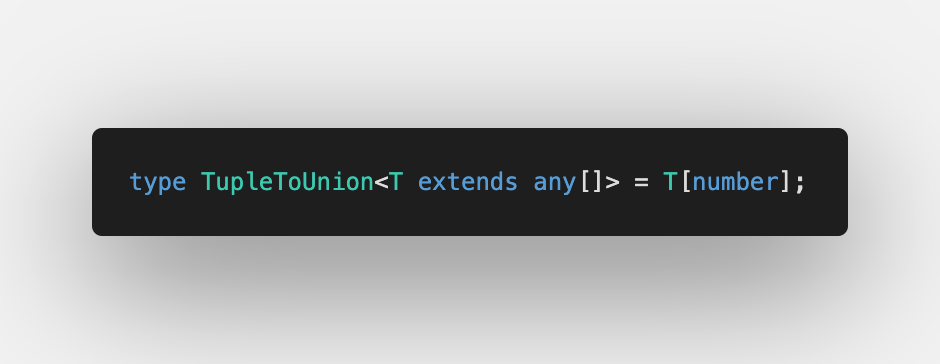

Today we discuss [Tuple to Union](https://github.com/type-challenges/type-challenges/blob/master/questions/10-medium-tuple-to-union/README.md)

We already solved a similar challenge [Making object out of tuple](/2021-04-07-making-object-out-of-tuple/).

This one is useful when we need to extract elements type out of tuple.

## Iteration over a tuple

As we discussed it in [Making object out of tuple](/2021-04-07-making-object-out-of-tuple/#iteration-over-tuple) and [Includes in TypeScript](/2021-04-16-includes-in-typescript/#iteration-over-tuples), we can use [Indexed Access Types](https://www.typescriptlang.org/docs/handbook/2/indexed-access-types.html) to get the type of tuple's elements:

Here we use `extends any[]` as [Generic Constrain](https://www.typescriptlang.org/docs/handbook/2/generics.html#generic-constraints) to be able to call `T[number]` without errors

All together in [Playground with test cases](https://www.typescriptlang.org/play?#code/PQKgUABBCMAMEFoIBUCuAHANgUwgFwHsIBVAOwEsDTJEE76aAjATwgEFS8ALK1gMVQQAFAAEAhpwBmqAJQQAxAFtsAE3KpFC8qUnYATgrwYcC1BSo0a86xACKqbAGc8lalBoBJRVmzLOEMQgAc2xSfXIAYwgAAzQfZAIyVwAeZAA+aIgAdy5IrggIggA3fUd8LlwisUwHMoJJAPxjXEIIcjwyqpqnCDNXADpLKD4CA2wADzFvHCGY6OiOmjxmdFw2PQMAXggAbQByaD2AGgg9gCZj04BmPYBdWcLSZwCALhRmhKSqZPW9NIhgMAIBNVhE8Kp8ERGLgDnsIAAfU4XBHXPY0ebRWb-ABq5GwWQgVAgAHF2gAJVCMN5cPB4dCOF6AjoRLj9ABWjn6oyCwDgYBAwDAQtAEAA+uKJZKJRAAJoEVAGADCBBUuDJ+lwUq14ogAqFy1W73iiXMpFSwPG4NIKjKEmYO1u-22yB2pA00L0twA3EKwCLtVqUE48BBFWJHD0A1LdYLyN5RiGAN4QACiAEdUNUTinxqCQwBfCCSPQETR7EQG7AIFnVHCkEKOYCoFyYRxosCVgrhnrbHY0HN55LpzOYVIfE0pHbQM5XE57AAsAFYAGyXPB6ByOk7Tq4ohcruGI9cONJpI793PYMFDjPVMfGr5mqczrcwGen8-3X3+qPSgR6bh9AgABlcF6TFX8dT1UAaH+YCuDEPRcGYeUDEcAgahcKgGQgGk6QZJlHBZdlOW5XlYGACRHCyfRYIgXF8QgdDMNcHC8PpRlgGZVkOS5PQeTgYBmObVi6IAWVGXBFQQzA6wbalaQ4wjiN47l+UFMAgA)

Have a wonderful day ☀️
