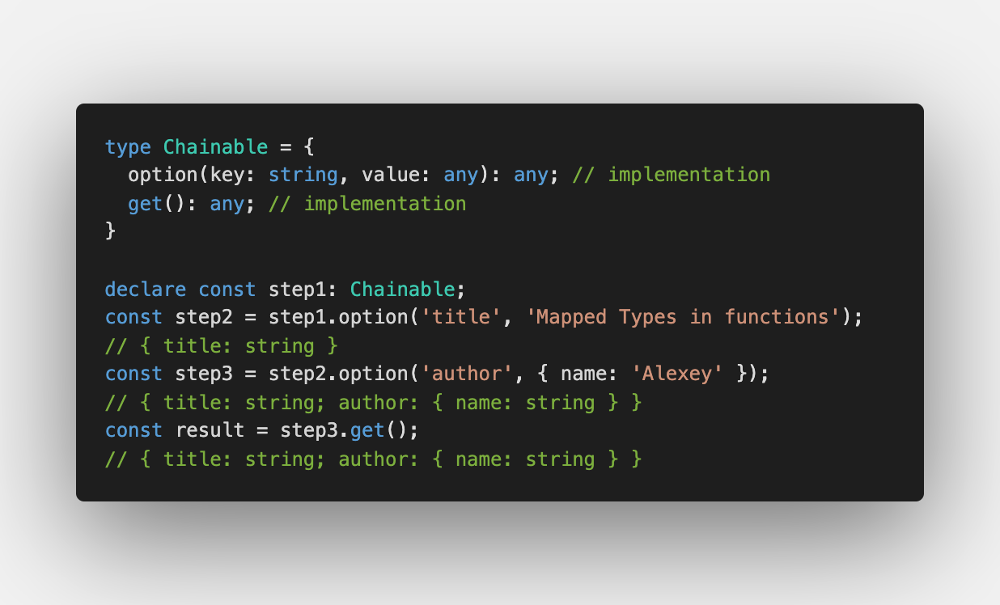
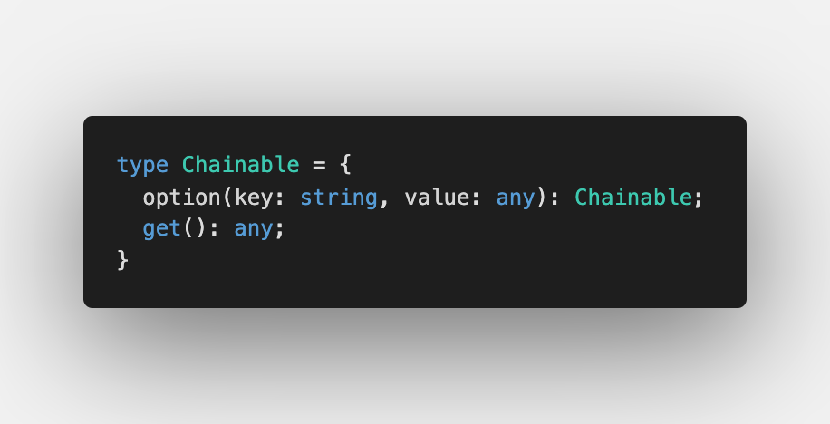
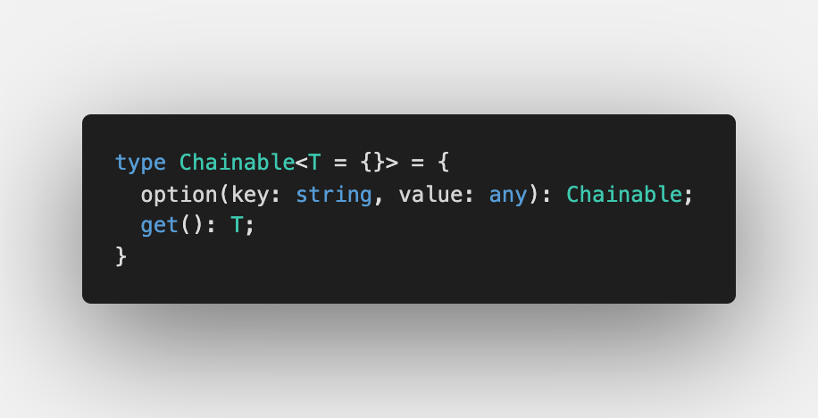

Today we discuss [Chainable Options](https://github.com/type-challenges/type-challenges/blob/master/questions/12-medium-chainable-options/README.md)

That's one of the most popular challenges I've worked with: you need to connect the data type with event type, e.g. for your tracking or logging.

But the difference here is that you need to infer type from the calls.

## Collect types from calls

First we can do is to return `Chainable` for a function `option`:

Next, we say that we start from an empty object type and call after call we collect the data type in it. Let's add `T` as [Generic](https://www.typescriptlang.org/docs/handbook/2/generics.html):

Last but not least is the collection itself. Let's add types for a key and a value as [Generic](https://www.typescriptlang.org/docs/handbook/2/generics.html):

If you check [temporary solution in Playground](https://www.typescriptlang.org/play?#code/PQKgUABBCMBMEFoIGEAWBDAlgO3QIwBsBTCAeQAcAXTAe2wGdJEEXWm8BPCAQW0tTpcAYgFcIACgAC6PgDMRASggBiALZEAJphGqV6cuQKYAxump0mTZdYgBFEUXrnslqGiy5CJGlVoMI6ABOJMY0qqp0BFwi9JoQOBAAUugAbuj0xoGYVAB0EABCIpQQAO6oRNilJPQlmJTGqBCUNBAAKhzkRADKmdmUADQQppUcNGLkgT5EgVFNHSR1APyuEACSlfyY9EMYBMTYAOZEg6Ni2ERxzXOdAZU0eABWRMbFNIEBQwTp20hlZkQpaYQU4QIwAaxISCuExoKUwGhIlBKLXk2BefggAAMfM5xBCOIM0gQHApMbcNFijpRxKS8ussTi-JiTmMhjIIEQAB6UCoU-ghESBYJ8IZ0WSYA7XEicJrlCAHTCAyr48kQIkOPIAdWqAhEBAp+DGxSu6GMxkc235EHFuAIEGC9D1xTh6EpREomJyKyEbw5nPQqkMRBWmNDlEYUARxi+wVFDGKoWw4oOAC4UBgcPhiCtE057Y4nRAALxx5NMKA5Rl0cQAclkNBoNcGcAAzApyxBK75qzXcOomxAa5R5ggGug9hUjvQa+2oBWq9ha3gggOAN5q8cONM1gASRD2LU1b31NYgAF9Z3OclSaStgMA-Z0XrLEfMIDRZPnHQRjS08EQUyYHAeUCWRTRIAAlAsfwgVcO3rGg02wHR-0CDs+wAiAnCyQ4O2XQI0zguc53VTDsJwA4OzPJhqKgUNMRWABNVkNDoIcIHOS4WhKLIeVuLgHnoYBw1BGgFWMJoWgwbANGIF8IBhLxdCQB4YmKBJhxuYhAQIPImNZYYAnoR11FlMwsXxMlIi4U1zSobZMXIw4yRkPk5UxUiyUM-9+M2Q5EAgVS82IVIFmKdIEC2PIugDEhMUs0o2OKHzyG+S5anNL0oCYAA+CAADVMCIEp30qABxOodxEPA01QShKHIegU3vcMGhyQTK0CA5gDgMAQGAMBBtACAAH0xvGibxogZjBRQGgEQgPdY0mlaxogfqhofTSSHcTMvAAHlaYtYLPPKSzg+85wXfaAGlBnynK8SIDg0zujdiUw-KFDTXbPGIQ6IAAMlgiAAG0boAXTTfKAG5zxymGwEuqAb2+tokYfaiwG29MPCzIgAfO07jqI99u2wW77se-FXsJTdPrR378YB4H13B574kqSHofhxGUfdGk01aRGseG1aVraRximQdJHFG8WJvWgbMEDN5inXbhwWOCAAFFOSfYoz2tSZdBrSRttHXZ9inYAikwAhp0GqMYxCOg83QH6Mz+4MwFzYoHULEt0CYLtcTrBsB1bS9Q78JcV0GddSO3PcDwgI8Zg0U8LxDhdawwgchxHMcJ0ORwZxD1HBpx0xYm2EtQaYPWDf2zXMAhfbto-L8nUGJvnh5DQcpysAIart8+5eOJzqYBCkJQ6Z2CCQiOyTrDKBwyioFojjYrTJzKKxoaQHlhW1tEQJ+XeLoeUak-T6VpHwCgPKugwWNTneegaGJZwmogOqGpNRahkVA7V6CdW6nAYAMgagL2fgVIqJUv4-z8H-ABjVmrCRAWAiBPVYDAGQXbN2uUIAAFk3g7StpORwtV6oYOAW1DqbxKIbTAEAA), you will see that `Type 'K' is not assignable to type 'string | number | symbol'`

It means we need to apply [Generic Constrain](https://www.typescriptlang.org/docs/handbook/2/generics.html#generic-constraints) for `K`, it should be a `string`:

That's it 💪

Don't forget to check [the solution in Playground](https://www.typescriptlang.org/play?#code/PQKgUABBCMBMEFoIGEAWBDAlgO3QIwBsBTCAeQAcAXTAe2wGdJEEXWm8BPCAQW0tTpcAYgFcIACgAC6PgDMRASggBiALZEAJphGqV6cuQKYAxump0mTZdYgBFEUXrnslqGiy5CJGlVoMI6ABOJMY0qqp0BFwi9JoQOBAAUugAbuj0xoGYVAB0EABCIpQQAO6oRNilJPQlmJTGqBCUNBAAKhzkRADKmdmUADQQppUcNGLkgT5EgVFNHSR1APyuEACSlfyY9EMYBMTYAOZEg6Ni2ERxzXOdAZU0eABWRMbFNIEBQwTp20hlZkQpaYQU4QIwAaxISCuExoKUwGhIlBKLXk2BefggAAMfM5xBCOIM0gQHApMbcNFijpRxKS8ussTi-JiTmMhjIIEQAB6UCoU-ghESBYJ8IZ0WSYA7XEicJrlCAHTCAyr48kQIkOPIAdWqAhEBAp+DGxSu6GMxkc235EHFuAIEGC9D1xTh6EpREomJyKyEbw5nPQqkMRBWmNDlEYUARxi+wVFDGKoWw4oOAC4UBgcPhiCtE057Y4nRAALxx5NMKA5Rl0cQAclkNBoNcGcAAzApyxBK75qzXcOomxAa5R5ggGug9hUjvQa+2oBWq9ha3gggOAN5q8cONM1gASRD2LU1b31NYgAF9Z3OclSaStgMA-Z0XrLEfMIDRZPnHQRjS08EQUyYHAeUCWRTRIAAlAsfwgVcO3rGg02wHR-0CDs+wAiAnCyQ4O2XQI0zguc53VTDsJwA4OzPJhqKgUNMRWABNVkNDoIcIHOS4WhKLIeVuLgHnoYBw1BGgFWMJoWgwbANGIF8IBhLxdCQB4YmKBJhxuYhAQIPImNZYYAnoR11FlMwsXxMlIi4U1zSobZMXIw4yRkPk5UxUiyUM-9+M2Q5EAgVS82IVIFmKdIEC2PIugDEhMUs0o2OKHzyG+S5anNL0oCYAA+CAADVMCIEp30qABxOodxEPA01QShKHIegU3vcMGhyQTK0CA5gDgMAQGAMBBtACAAH0xvGibxogZjBRQGgEQgPdY0mlaxogfqhofTSSHcTMvAAHlaYtYLPPKSzg+85wXfaAGlBnynK8SIDg0zujdiUw-KFDTXbPGIQ6IAAMlgiAAG0boAXTTfKAG5zxymGwEuqAb2+tokYfaiwG29MPCzIgAfO07jqI99u2wW6-R5GTticg57se-FXsJTdPrR378YB4H13B574kqSHofhxGUfdGk01aRGseG1aVraRximQdJHFG2WJvWgbMEDN5inXbhwWOCAAFFOSfYoz2tSZdBrSRttHXZ9inYAikwAhp0GqMYxCOg83QH6Mz+4MwFzYoHULEt0CYLtcTrBsB1bS9o78JcV0GddSO3PcDwgI8Zg0U8LyjhdawwgchxHMcJ0ORwZyj1HBpx0xYm2EtQaYE2zf2-XMAhfbto-L8nUGDvnh5DQcpysAIYbt8R5eOJzqYBCkJQ6Z2CCQiOwzrDKBwyioFojjYrTOmwCxoaQFVtW1tEQJ+XeLoeUaq-r41pHwCgPKugwWNTneegaDEmcE1CAdUGpNRahkVA7V6CdW6nAYAMgahr0-gVIqJUAFAL8CAsBjVmrCSgTAuBPVYDAEwS7H2uUIAAFk3g7QdpORwtV6p4MgW1DqbxKIbTAEAA)

Have a nice day ☀️
