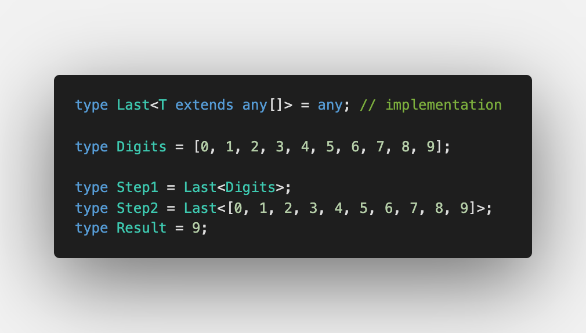
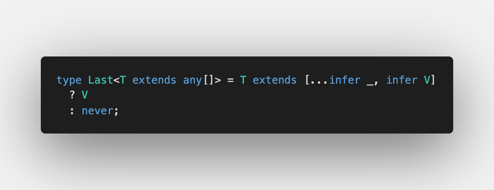

Today we discuss [Last of Array](https://github.com/type-challenges/type-challenges/blob/master/questions/15-medium-last/README.md)

We already know [how to get the first element](/2021-04-08-infer-first-element/). We can use it for both arrays and tuples, but for tuples you get exact value.

To distinguish arrays and tuples, please visit [Making object out of tuple](/2021-04-07-making-object-out-of-tuple/#an-array-or-a-tuple)

## Extracting last element

For the first element, we don't need an iteration over tuples and we just use `[0]`:

Since [TypeScript 4.2](https://devblogs.microsoft.com/typescript/announcing-typescript-4-2/#non-trailing-rests) we can use rest elements not only at the very last position of a tuple type:

With [Type inference in conditional types](https://www.typescriptlang.org/docs/handbook/release-notes/typescript-2-8.html#type-inference-in-conditional-types) we can skip all elements but the last one:

Done ✅

Please find the solution with test cases in [Playground](https://www.typescriptlang.org/play?#code/PQKgUABBCMCsEFoIBkCGBnALhA9gMwgEEAnY1AT0kQRtqoCNyiA7TACx2aYDEBXCABQABVKzy8AlBADEAWwCmAEwCWvWTNSkKVKtL0QAir3lZlnHVAB8EACrkADvIDKAY2LL72ACwA6AAwQyugQxPIuOLIKzIpKgcwQ7EEQLmyoADZp8swA5vIWEACSsvaZUdioELnM8u4uEAAGaFgAPDaW9Qmp2JioANYmEKJEWkz1Nh2iiiHymLzEzMHKmADkwWkY2PKlWSvBmA7yPvncOMQQ8gAeqMWZ+fX3mOhU+46DpNAQALwQANrLqMsADQQZb0IEglzLAC6zwOb2IACYvr8AMzAhHA6AwqCw149ZRpD7fJqYZqaYjQazAYDnC6OFyYWKYHAQejyCHLXHs-FpJHEjZk0gIqk0y70xlTZms9nQKj3er5awANWU8gA7rh4gBxJYACV49AAXBA2JhMPZ0IbqY8Uj4AFboHynbLAOBgEDAMBe0AQAD6-oDgYDEAAmjg5hAAMI4GIQXU1dlBpP+iAer0vdkk1q0xnRYKicg-KHWb42HNZRTBH4+GvKZh4Gp+4F1htnJXYiAAfggSqoxuqADcagBub0gP3JoO2EzYSMYAaTqdp5TFU7YADeEAAogBHXjpYFbulhbAAXwgeGIERBQgzCBS6UyORMwF4mAJ6E5YAzyXnwW+PxUEe4rNLu+5pM0WY-GiEAYjAxaYpYliAkBx4MqBe7pJBAo-AIUifNY0AIjBm6oMaWDuDkECnghECkeRmCUdk1FIShMJemAPqLoGEB8MQ7CNk4jIWhO3G+qmnqgFQ1hOKkoQQOQ4ZnOgOBpG+ZgLMaprmpa1roLaDpOsQLpwMAojoGqNTST2qoaipanvpwlommaFpWsANpsPajrOq6sDAPZ6lOdZACypzspGqQZFkuTOdpbl6QZPnGe6npgEAA)

Have a wonderful evening 🌆
