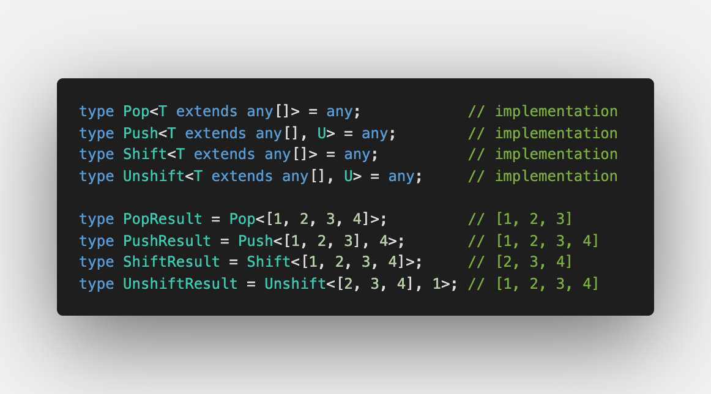
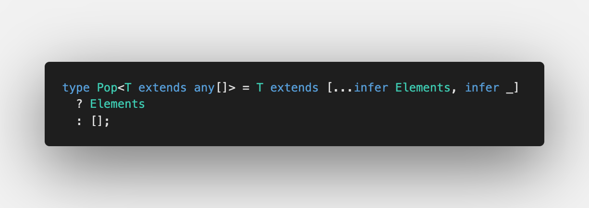
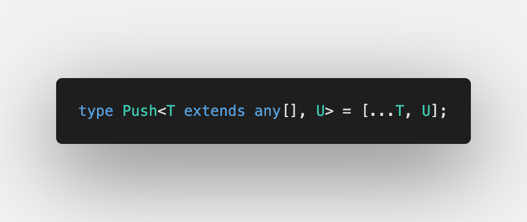
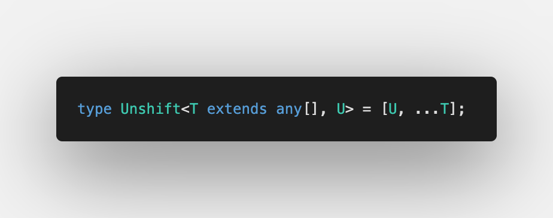

Today we discuss [Pop](https://github.com/type-challenges/type-challenges/blob/master/questions/16-medium-pop/README.md) and other methods: `Push`, `Shift` and `Unshift`

We already practiced getting [first element of tuples](/2021-04-08-infer-first-element/) and [last element of tuples](/2021-04-29-infer-last-element/)

Let's apply our knowledge again 💪

## Pop

[Array.prototype.pop](https://developer.mozilla.org/en-US/docs/Web/JavaScript/Reference/Global_Objects/Array/pop) removes the last element of Array in JS.

Since [TypeScript 4.2](https://devblogs.microsoft.com/typescript/announcing-typescript-4-2/#non-trailing-rests) we can use rest elements not only at the very last position of a tuple type.

We will infer all elements but the last and return them as result:

## Push

[Array.prototype.push](https://developer.mozilla.org/en-US/docs/Web/JavaScript/Reference/Global_Objects/Array/push) adds the element to the end of Array in JS.

We spread all elements we have and add the pushed element to the end:

## Shift

[Array.prototype.shift](https://developer.mozilla.org/en-US/docs/Web/JavaScript/Reference/Global_Objects/Array/shift) removes the first element of Array in JS.

So we need to infer all elements but the first one and return them as result:

## Unshift

[Array.prototype.unshift](https://developer.mozilla.org/en-US/docs/Web/JavaScript/Reference/Global_Objects/Array/unshift) adds the element to the beginning of Array in JS.

We spread all elements we have and add unshifted element to the beginning:

## Summary

We just applied spread in different manipulations with tuples.

If you're interested with examples, please have a look at [Playground](https://www.typescriptlang.org/play?#code/PQKgUABBCMBsEFoIAUD2AHSiE91gRgJ4QCCAdgC4AWqZxAYgK4QAUAAgIaUBmjAlBADEAWwCmAEwCWjYUI4AneR0JYsg9RACKjUQGcKk2qqgA+CABVC6UQGUAxvMnoKEACwA6AAwRJuiPNE7VGExMnEJHzIIal8IOyoOABtE0TIAc1FjCABJYXQU0JcOCAyyUUc7CAADNHQAHnMTKuiElwoOAGs9CC5SRWVq82aucX9RCkZ5Mj9ekn7iAHdJalRGF2WAcj9Ejn0IUQLUincs+lR5fYAPDjyUrKqHil0sCitRHsVoCABeCABtDYcDYAGggG3wILBdkhG3EGwAui83h95AAmH7-ADMoNRoOgiKgSOsYy+v1qdQU8mgZmAwCu1jsFAiFFQEHw7wBQNB4Jh0IJ0WRAXRZIwFMUqJpdNElwZTNGLLZHOxEFR-IeVSyIBAAFFLhQlFqAFwQGySYSSHbyRKEUF2XqEVY+W6iQrVGxUSTcChVUE1Ri6KjDMLVACq0w9XuGfgWB0SAH4smYAGqSUQLCC0CAAcWWAAlGPhjVQKBR0LpDbSnvF3AArXTuc5pYBwMAgYBgDugCAAfV7ff7fYgAE1VhcAMKocIQXPld4D+e9iBtjuvYnk8xXJlhGZ0P7wsy-DfSrfiPx-dwXyRkbjlCDaw6UXSgq83i7d-lxu8Pp5YY17gDcYCru8yD+lQDSbqkp49Lu8KgiGB7-Be7jmPB8KAcBJoRhQEHHlBO6EHuiFHnq+H-C+t7dqCyEURc94ukcugfl+DGPr+-zoUByJhgGno4SRJ4EXu8GIX8IbURe5icR2YBdgu84WHoLhjrs3TyQOS7tma6DnC4ADed4AI6MEkoK6rKEAAL4QNw8jBGCbDAQg8RJCk6R6MAawWroGwrsidq6N0vx-FgtIQDpmBQOZgQ4dqxlJHU5JEaCREmMCWDRYydRxSZiSJaKfzKriMD7ilRX7mlGUyjF2XxXlSWAjCELctC3JwqCpX-I13LNVCCImJVUBhegYFVbKtW5YlYF1MJMBpf8+IDelUXVVlOUJaBAYzeVeLzYVOJ4hVy13qtsV1VNW2ck1vIIm1Gx7d1YK9RsrVgnCR2hXSvFemNNXrXl7p8TNnWpcdmVnZNgNettB0lXtxWLYNJ3jf9dRQzhV09Tdd0dQ9z2vbC-VI2FjDhnxv1redPHYcDu0pYjYOnRNCXU0DfwI3BECYntRWHUtFMQyzZPQwC+Mwu93JAg9XJPdjb1E+liIyXJ6mDkw8jULeNhMmWPaq4uy6gFgZjugo7wOpMEC6KgiRebQ5YQMWpblpWujVnWDbyE2cDAFwugxvIxsQCmaZWzbdvTEWJZlhWwBVlQtb1o2zawMA1u2wY9tBwAsuc7xjgkySpBkDtOzHrvu0nXutu2YBAA)

Have a good evening ☁️ and nice weekend 💃🕺!
