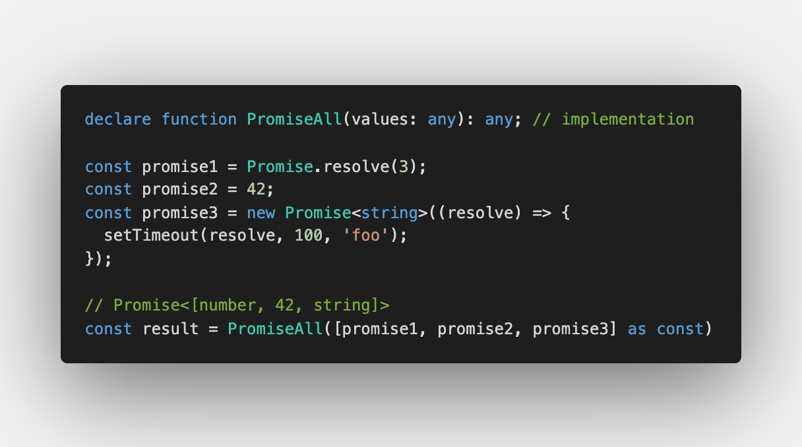
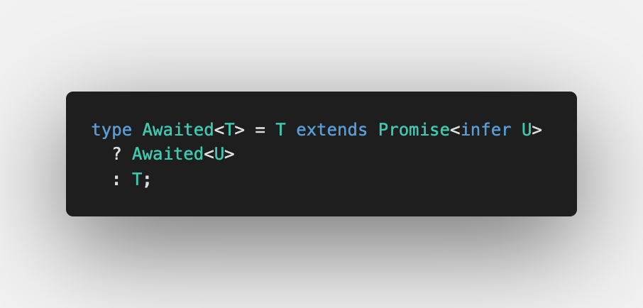
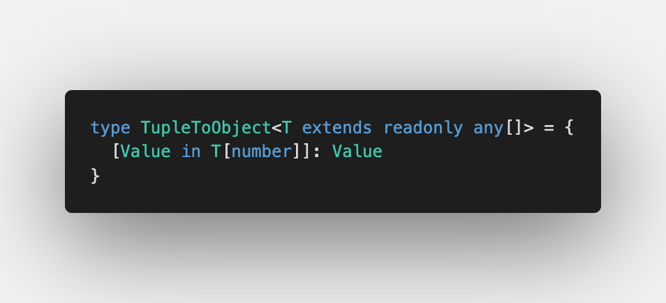
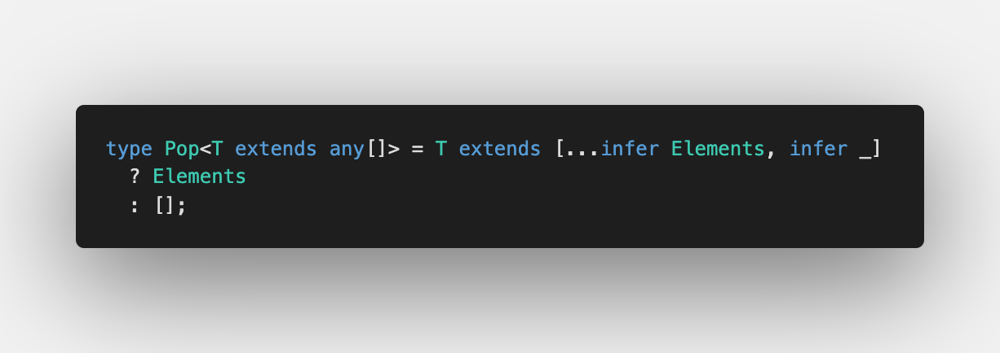
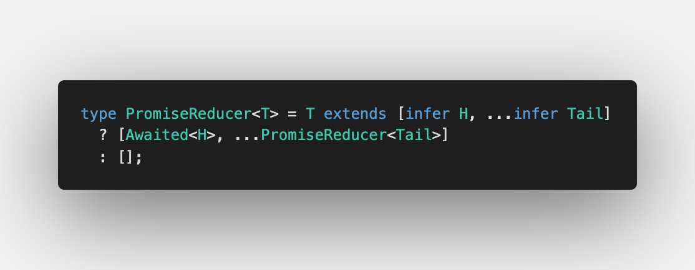
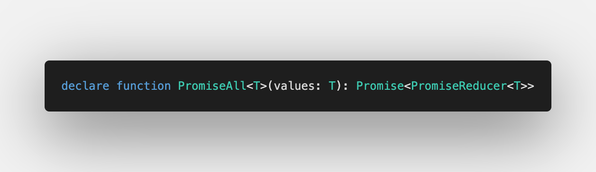

Today we discuss [Promise.all](https://github.com/type-challenges/type-challenges/blob/master/questions/20-medium-promise-all/README.md)

Here, as you see we need to convert types from `[Promise<number>, 42, Promise<string>]` to `Promise<[number, 42, string]>`. Let's do it 🚀

## Iteration over tuple elements

Previously, one of the challenges in easy category was [Unwrapping Promises](/2021-04-13-unwrapping-promises/) where we imitated `await` in types:

This will help to iterate over tuple elements and replace `Promise` with the resolved type.

We already know how to iterate over tuple elements with [Making object out of tuple](/2021-04-07-making-object-out-of-tuple/#iteration-over-tuple) but here we have the difference:

1. If we want to have elements of tuple inside the object type, we use [Mapped Types](https://www.typescriptlang.org/docs/handbook/2/mapped-types.html):

2. If we need to work with tuple elements and leave everything as is, we use [Type inference in conditional types](https://www.typescriptlang.org/docs/handbook/release-notes/typescript-2-8.html#type-inference-in-conditional-types) with [Rest elements in Tuples](https://devblogs.microsoft.com/typescript/announcing-typescript-4-2/#non-trailing-rests):

As we need to transform the elements inside the tuple but still need to have the tuple at the end, we will use the second approach. Let's go over all elements and unwrap it with `Awaited`:

The only thing we need to do is to apply it to `PromiseAll`:

Let's see what happened in [Playground](https://www.typescriptlang.org/play?#code/PQKgUABBBMAMEFoIAUBOB7AtgSwM4FMA6AQwBtTJEFqbKAjATwgEEA7AFwAt1WmAxAK4QAFAAFiHAGYCAlBADEmfABNsAzAuKpUxJvLoDspdgmytKleVYgBFAflztsPC1AAqDAA74IXH9NYAYyceCAADNCw8fGZyMN9OYnYIYkDA-E92XBTWFO1dCHRJFAwcAgAZbABrH3Q6ACt8YNwAGgSfVHx2AVRWMwBzCAA3MnsIXG4BUmUIOh8I0uiAHjcAPniAd058TvC3eLx2iE7cdFIhlWOHKeStHQZCV3CwsKzKQJ5HCE9FggBGCAAXhKUQIhBOZwuwgAzDIANzvT7JH6g-DQIEQAAs0ARUA+rC+KLK+GhGNY+A2IOJS0cqAGq2Ewgh53wbU6jWCckBqwgAG9KFACOw3NglOgBOwmQ5IayIH9YLA2gBySTodBK+GUAC+mqglGAwAg+AAHt5gpd2OhZvNItSANqsdRzVBtR2YZ1tWkDAC660RBORGNt0RI5GEdqJ0T+bUjBGgMd+JO9KWy+McMkoLzCTx5ADVsBTCrkAOLYdgACQEdAAXBBOOx2J5cNWDVlApxCPVcIR0Kh+sA4GAQMAwKPQBAAPpT6cz6cQACa4tQEAAwuhlD5yzsfLPd1OIMPR+wvD5mBtiGWVCsecC3Ebjex8KxlNlgwQlmZJDsIABVVaUAB+Fhz0vZQlj-ShazcBEwGPbwqWiAAlFQBHSVBrwxO8TUfZ9sjtT9v3LNpCBIgjlzcC9SG9QCIDtM8L0fMDy1WYiSLffBkOUVCdhWSjVmoqBaztb0YI3QJSC0fwBCCEJcnY2JSGvYQRlIexmwgNwZFrdilnYzjuPQtZ-zAcc913DSHGSFdiAIbIzNnA8R1FTxe2SXkIAAUQARwEMg2g800mmSLUIEkUoICVUQ4PwBB2zIUgn36BxgAlIxcCVUc02RRMFLcSyAWBeSwztaMYDaaFkxsiAsozLLvhy8g8scdFCoa0hw1K+MELBZkoVhSrUyRWqkXq1Fcss0lWrG4rOradjwWlFkYRkb0M1gk9qpshwMTtSgArNdglm83zFOiopRuJcbHFKnSSraLqKtWJ6Wj2wLgiOnyyCWM7iljGJGssrrbtmiA3WdX1nteg6PpO76T3Ov6rvYaE5sTJYHSdHZXUxl1QZxiGWLAajRxMkBJ3sudBFQPxlwAZUfJtyYpidHNJygeVpxJdgYJdxjOVLPlretG2bVtcHbTtu17fs4GACRcA2HZ2YgfNC1OVTZPU4WmxbYA2w7Lsez7AdYGAdWBYJZWAFlex8FdEnIRKHCFhsdbFiXDelocRzAIA)

## Working only with tuples
