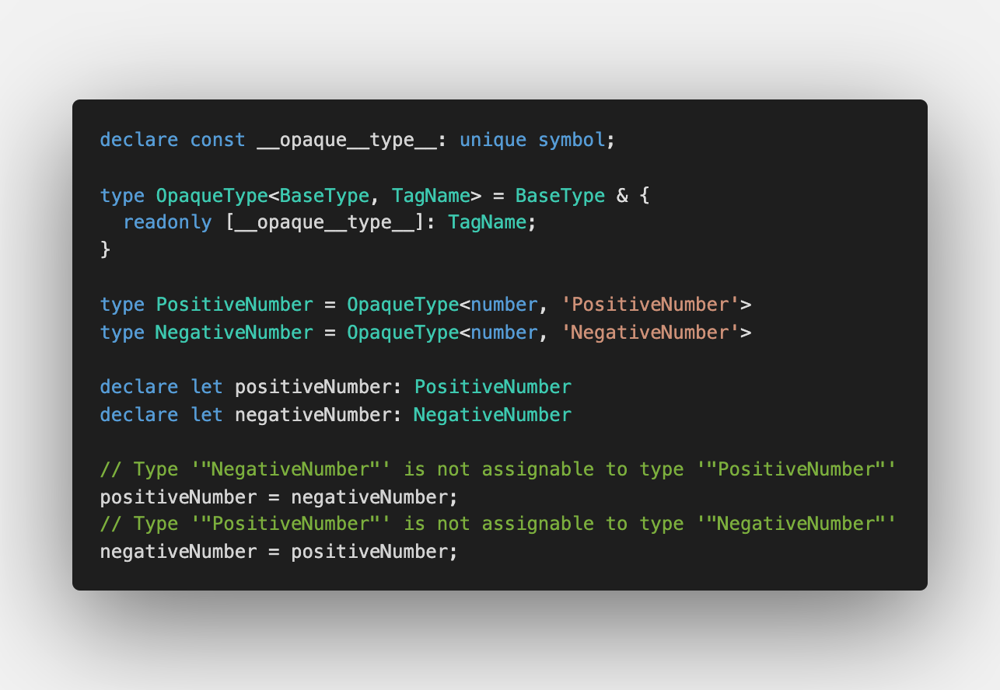
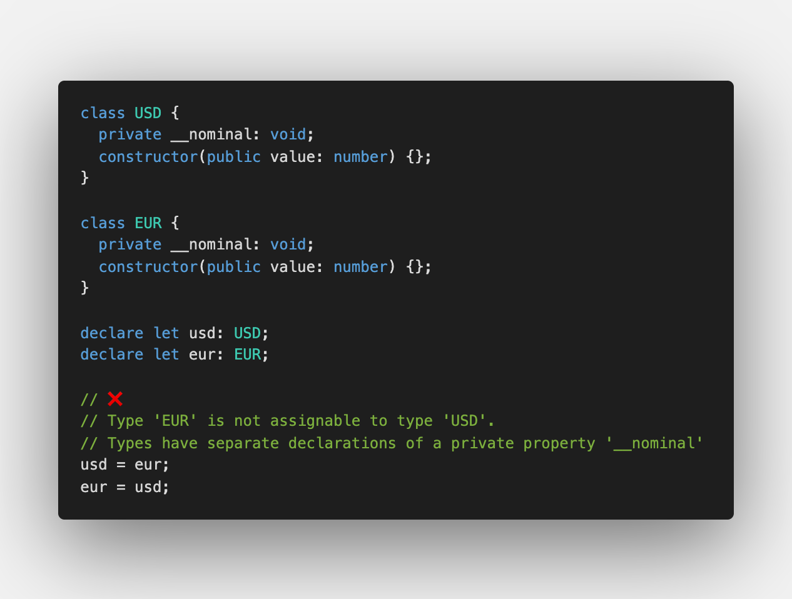
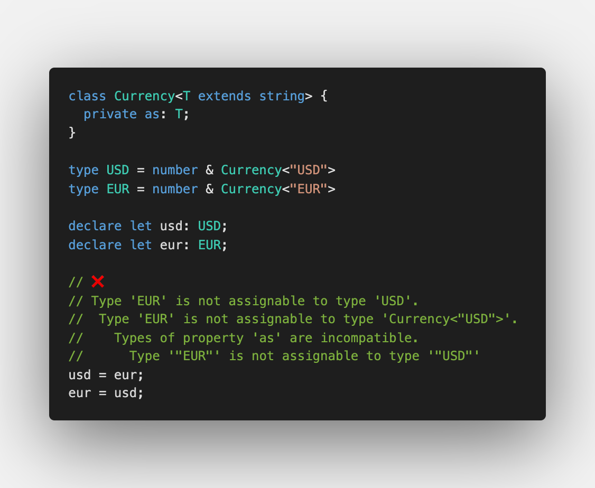
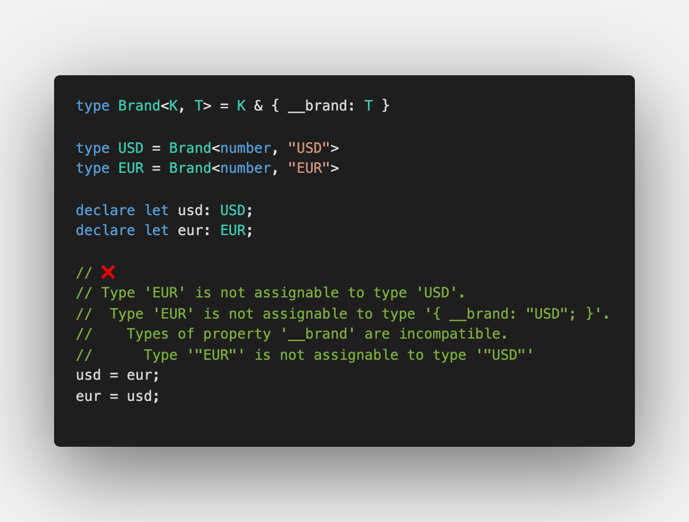
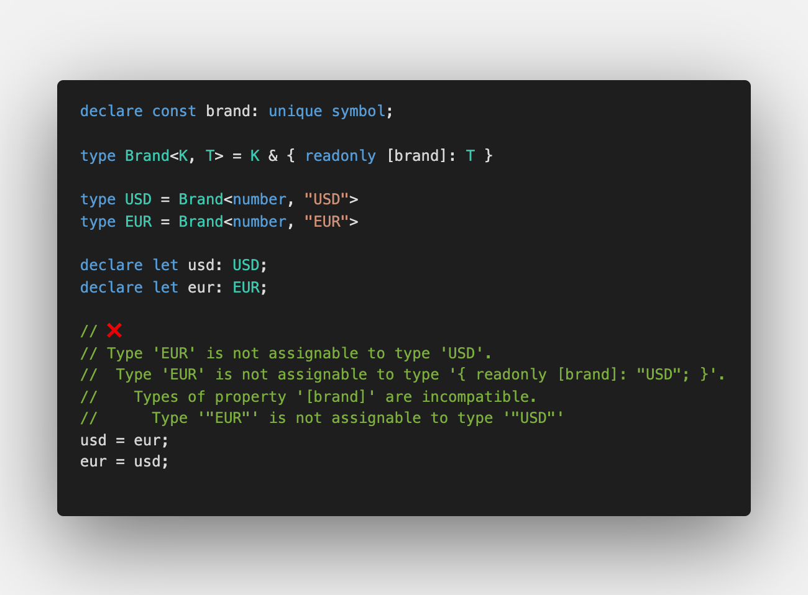
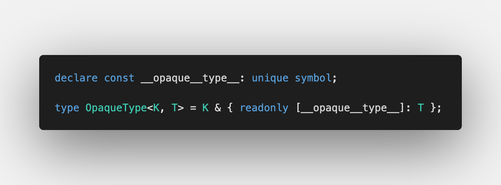
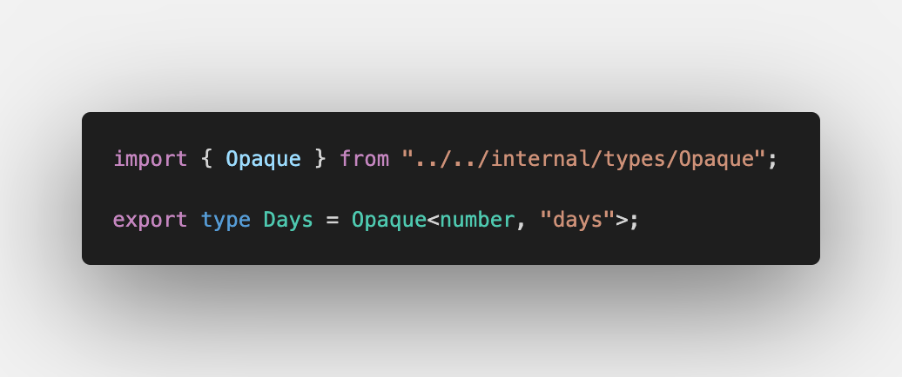

Today we discuss Opaque types:

1. [What problems do they solve](/2021-04-19-opaque-type-in-typescript/#the-problem)
2. [What ways could we solve this problem](/2021-04-19-opaque-type-in-typescript/#probable-solutions)
3. [Why I chose this solution](/2021-04-19-opaque-type-in-typescript/#probable-solutions)
4. [Describe the solution in more technical details](/2021-04-19-opaque-type-in-typescript/#unique-symbol)

## The problem

TypeScript, like Elm and Haskell, has a [structural type system](https://www.typescriptlang.org/docs/handbook/type-compatibility.html). It means that 2 different types but of the same shape are compatible:

It leads to more flexibility but at the same time leaves a room for specific bugs.

Nominal typing system, on the other hand, would throw an error in this case because types don't inherit each other so no instance of one type cannot be assigned to the instance of another type.

TypeScript didn't resolve nominal type feature and since 23 Jul 2014 has an open issue: [Support some non-structural (nominal) type matching #202](https://github.com/microsoft/TypeScript/issues/202).

[Ryan Cavanaugh](https://github.com/RyanCavanaugh) described the cases in [the comment](https://github.com/Microsoft/TypeScript/issues/202#issuecomment-329914167) where nominal types would be useful.

## Probable solutions

Let's see how we can imitate nominal type feature for TypeScript 4.2:

### 1. Class + a private property

Here we define `class` for every nominal type and add `__nominal` mark as a private property:

[Code in Playground](https://www.typescriptlang.org/play?#code/MYGwhgzhAECqDKARaBvAUNaAHATgSwDcwAXAU2gH0KA7AewFs9qwQAuaA2vAEwG4NowWtQjEcAV2DFaOABRZxAIxB5gHFuNLtq4+otI4AlKgC+-E2jShIMAKKwASqgG5CJclTqNmbDlz4CQiJiktJyCsqq6iCa2rr6Rqbmltyk1jjkIKTE0OIQ3OwIiPyp6ZnZ0KTiOOz2DvxoAPSN0IAy5E0tACoAnljkAOR1-dB4MHQ5NngA5szK5NLQxL0DRf0AdB3QPX0wABZgBOQQpFhgOO7QpeDnxHjCMLQAZtBg2PhEZG+0fThL0P2eBhMFj9NB5bjQAC8lWq-CqOChuXyvCAA)

### 2. Class + intersection types

We still define `class` here, but for every nominal type we have [Generic type](https://www.typescriptlang.org/docs/handbook/2/generics.html):

[Example in Playground](https://www.typescriptlang.org/play?#code/MYGwhgzhAEDCCuAnRBTAdsAngHgCrRQA8AXdAExgmMQEs0BzAPmgG8AoaaAB1oDcxS0SAC5ouANxsAvmzbFMXFNACqAZQAi0ALzQ08ALYAjFImgAyOElQYcAIjXrbjOQqUBRZQCVtug8dMWCMjoWNi2Hp5OsmQooGCo0CAoxNDwEGSiDpIxcQlJKShIohGSbAD0ZdCAMuTllbiu0ADkEY3QNDBoAPYpkBA09GhghknQxJ2jDY0OjQB0tZz1ik0tbR3dQlD9g8NKYxNLjUHWofYaTrPznGKuMJ0AZtyInYqI8k2QrfFKdMCd+lwCGg7OYVK5XRZKRrhLy2VrtXTrXpbIYjPbyA6nRyNNhpMg+QqISQEny48RAA)

### 3. Type + intersection types

We only define `type` here and use [Generic type](https://www.typescriptlang.org/docs/handbook/2/generics.html) with intersection types:

[Have a look at Playground](https://www.typescriptlang.org/play?#code/C4TwDgpgBAQgTgQwHYBMA8BpANFAKgPigF4oMoAyKAbygH1aAjRVALjygF8AoL0SKAKoBlACLFYzdEgCuAWwYQ4OAETCRy-L3DQAogIBK4+MilyFSqMr36NPFBADGAGwRxoTiMCjSAzijZqANxc9s6u7p5QENJwbNbBXAD0iVCAMuRQPgD2shCZSNAOyN4+0ACWXgzSXuVQKJkQPkgA5F4QAB6lPsBcvigAdPRMJjzJaUkpuNpQTdZNUJ1QSJleCD4+pQDmSAgMHlDAmftTTWpNfeNQeMez8z6Ly1Cr61s7ewdH-E00g5JsqqLKQKcM4XS5XSB3TIAMygYDgmUgcFA0x+Jjm4XmSAc2TACGApV2EHOozBl0mnysBmUcwWSxWa0220J+0OfGgTX+6iaPT84micGC-PEvWCQA)

### 4. Type + intersection types + unique symbol

We still define `type`, use [Generic type](https://www.typescriptlang.org/docs/handbook/2/generics.html), use intersection types with `unique symbol`:

[The example in Playground](https://www.typescriptlang.org/play?#code/CYUwxgNghgTiAEYD2A7AzgF3gIxlFwAXPAK4oCWAjiQmgJ4C22SEA3AFDsZ0AOCAQngIAeANIAaeABUAfPAC88UfABk8AN7w4UYKgh14AbVz5gAXWJT4AX07c+8AKoBlACIL4g08JQkmIGEkAIhdXIJkuXgQAUUcAJQ8vEV9-QPgg2LjwzlBIWAQIECwSNCInNw5c6Dh4QqwQEhhiTI52AHo2+EAZcnbOqSj4AHJMwfhyNHgUJCwoNDRyAHMUKGxC+AwkdYHB0MGAOl74aW2RsYmpmbnF5dWEDa2HQc1tXRR9IxMCC3TQoNYbfaHI7HPgTJAAM3gPBgSD4MG4Q2MQnMo3yYxQyAYPCgGHItwOHWBwP6jwy8SCo3Gk2m8Fm8yWKzW93sCEGITcFPYJWAHgaMA4fI83I4QA)

## Choose the solution

Let's compare all the approaches that are mentioned above:

| Approach                                                                                                                      | Error readability |        JS-free         | Can be reused |         Encapsulated          |
| :---------------------------------------------------------------------------------------------------------------------------- | :---------------: | :--------------------: | :-----------: | :---------------------------: |
| [Class + a private property](/2021-04-19-opaque-type-in-typescript/#1-class--a-private-property)                              |        5️⃣         | ❌ class + constructor |      ❌       |              ✅               |
| [Class + intersection types](/2021-04-19-opaque-type-in-typescript/#2-class--intersection-types)                              |        5️⃣         |     ❌ empty class     |      ✅       |              ✅               |
| [Type + intersection types](/2021-04-19-opaque-type-in-typescript/#3-type--intersection-types)                                |        5️⃣         |           ✅           |      ✅       | ❌ `__brand` visibility in TS |
| [Type + intersection types + unique symbol](/2021-04-19-opaque-type-in-typescript/#4-type--intersection-types--unique-symbol) |        5️⃣         |           ✅           |      ✅       |              ✅               |

1. All approaches have a great error readability (the problem is visible and it's connected to the nominal type)
2. First 2 approaches use JS: [Class + a private property](/2021-04-19-opaque-type-in-typescript/#1-class--a-private-property) cannot be reused, [Class + intersection types](/2021-04-19-opaque-type-in-typescript/#2-class--intersection-types) can be reused but still creates empty class (which is fine)
3. By encapsulation here [Type + intersection types](/2021-04-19-opaque-type-in-typescript/#3-type--intersection-types) make `__brand` property visible outside and can lead to stupid errors which I want to get rid of.

So if you don't really want to see one empty class, please use [Type + intersection types + unique symbol](/2021-04-19-opaque-type-in-typescript/#4-type--intersection-types--unique-symbol)

If one empty class is still okay, you can choose [Class + intersection types](/2021-04-19-opaque-type-in-typescript/#2-class--intersection-types)

I will stop on [Type + intersection types + unique symbol](/2021-04-19-opaque-type-in-typescript/#4-type--intersection-types--unique-symbol)

## unique symbol

It's possible to create a symbol in TypeScript without creating it in JavaScript. So it won't exist after compiling

Also, if you plan to reuse `OpaqueType` and put it to the separate file:

It's a good idea as in this case `symbol` won't be accessible outside of the file and therefore you cannot read the property.

## Example

Let's have a look at [CodeSandbox](https://codesandbox.io/s/ts-opaque-units-6j3ti?file=/src/index.ts)

It uses [ts-opaque-units](https://www.npmjs.com/package/ts-opaque-units) which implements `Opaque` function with unique symbol. For instance, `Days` is defined as:

## Resources

1. [Nominal typing techniques in TypeScript](https://michalzalecki.com/nominal-typing-in-typescript/)
2. [Implementing an opaque type in typescript](https://evertpot.com/opaque-ts-types/)
3. [Support some non-structural (nominal) type matching #202](https://github.com/Microsoft/TypeScript/issues/202)
