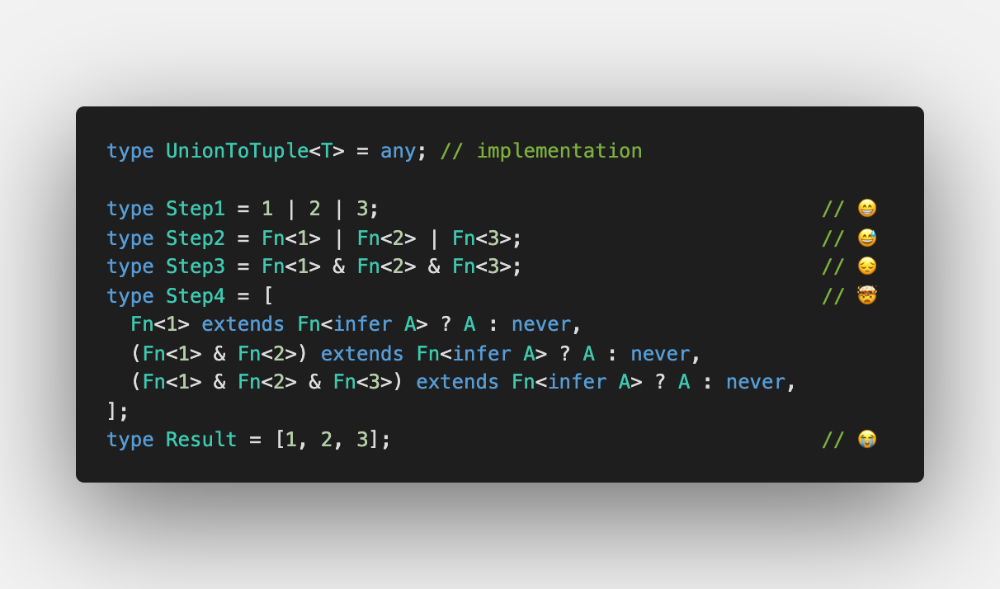
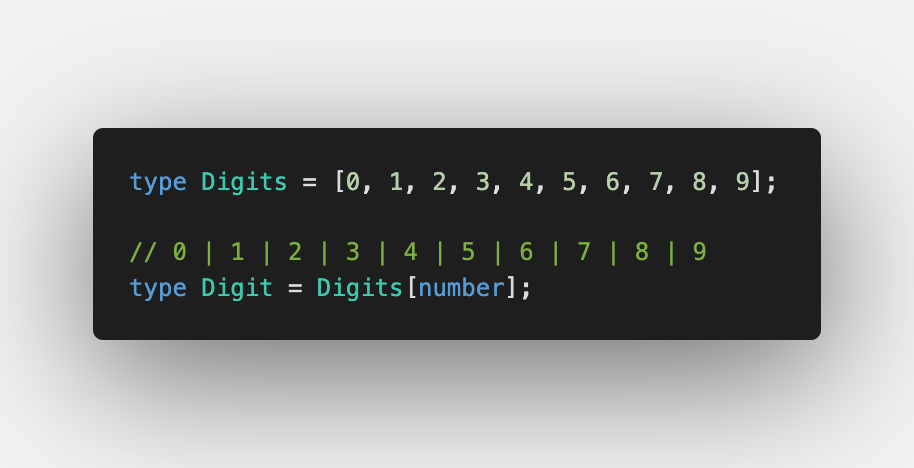

Today we discuss [UnionToTuple](https://github.com/type-challenges/type-challenges/blob/master/questions/730-hard-union-to-tuple/README.md)

This is really over-engineered task where we need to make a tuple out of union type.

Previously, I had a look at this problem from the different angle. Instead of defining a union type first, I created tuple type and then inferred union type which is much easier:

We discussed this challenge in [Convert Tuple type to Union type in TypeScript](/2021-04-27-making-union-out-of-tuple/)

But anyway, let's try to understand how to do a reversed challenge ⬇️