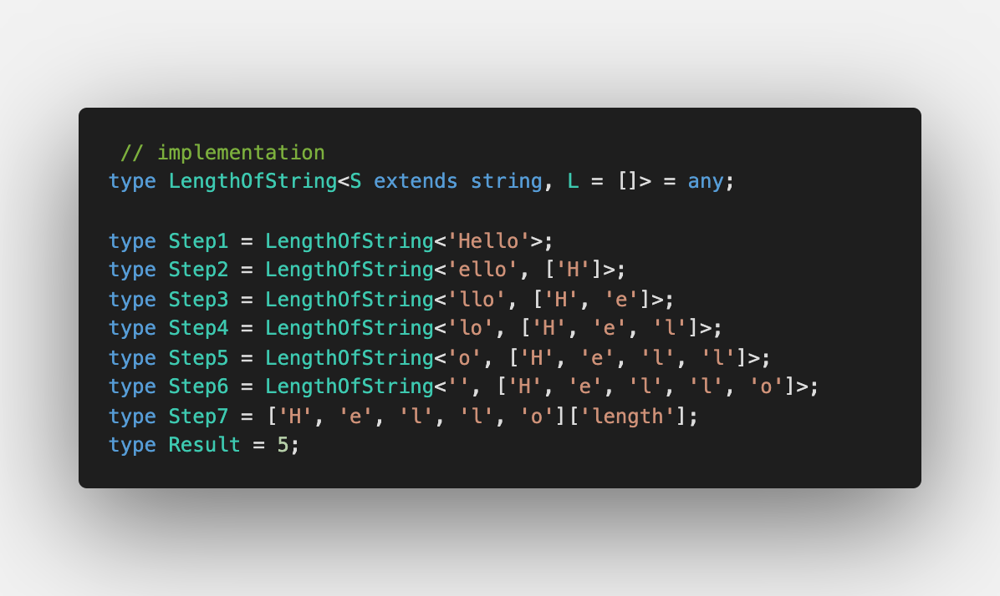

Today we discuss [LengthOfString](https://github.com/type-challenges/type-challenges/blob/master/questions/298-medium-length-of-string/README.md)

Sounds easy but can be tricky. Let's find out ⬇️

## Iterate over the string

First things first, we iterate over the string, right? 🧐

But construction `L + 1` is not valid in TypeScript 😔 Check it yourself in https://tsplay.dev/N9AMoN

So now we need to have an array of numbers. We can go to the browser or node CLI, call this JS chunk and generate an array of 100 numbers for the start:

Now instead adding `1` to the previous length, we shift the array (or remove the first element from the array):

But now at the end of iteration we will get an array, but not the number. The only change which is required now is to extract the length. As we started the array from `0`, the answer will be the first element:

Check that it's working – https://tsplay.dev/mMy2km 🔥

## Maximum string length

If you check which string has the maximum possible length at the moment, it's 43. After this length, we will get `Type instantiation is excessively deep and possibly infinite` – https://tsplay.dev/w62orw

We have a limit of 43 recursive calls.

Can we do better? Of course, but this requires a better iteration. Is it even possible? Sure 🚀

Let's first try to iterate over 2 characters at one time if possible. Otherwise use one:

Now the maximum number is almost increased by a factor of two: it's 85 – https://tsplay.dev/WoqppN

Can we still do better? Sure, but then we need to have a larger array (100 is not enough). Also, let's iterate over 4 characters at one time:

Now the number is 163 – https://tsplay.dev/wRp3Em

Do you see the consequence? We iterate over the power of 2 number of characters. Why do we do so? To increase the limit twofold in comparison to the previous solution (but it's not actually 2x, as `Shift` calls make it more slow)

What will be the limit if we continue to do so? Let's see the table for the dependency:

| Max characters | Max length | Improvement |
| :- | :---- | :------ |
| 1  | 43     |  -      |
| 2  | 85     | +97.67% | 
| 4  | 163    | +91.76% |
| 8  | 295    | +80.98% |
| 16 | 463    | +56.95% |
| 32 | 415    | -10.37% |

From left to right we see the maximum number of characters at one iteration, maximum length of string and improvement in comparison to the previous solution.

So I decided to stop on 463 😅 https://tsplay.dev/NVn1xN

Can you do better?