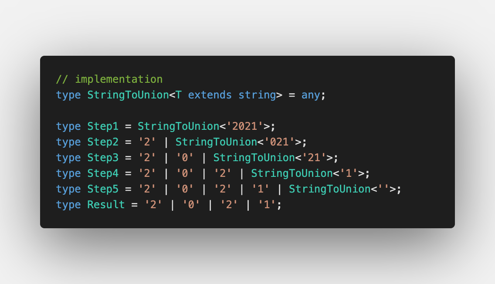
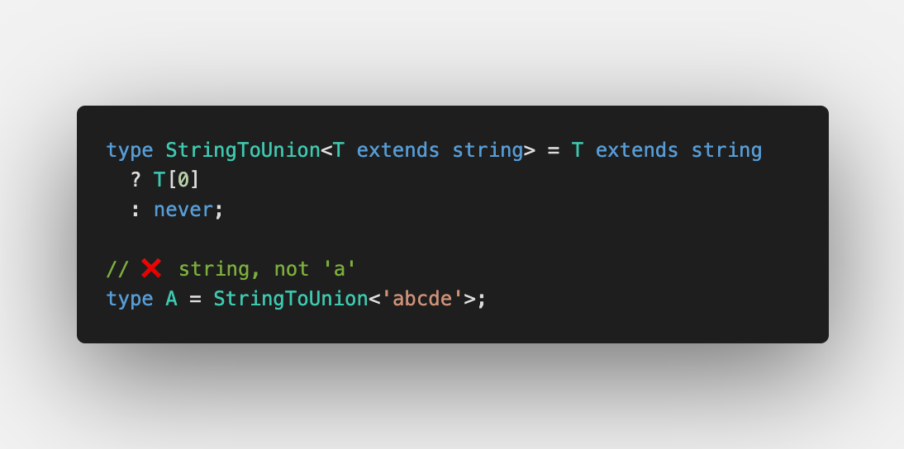
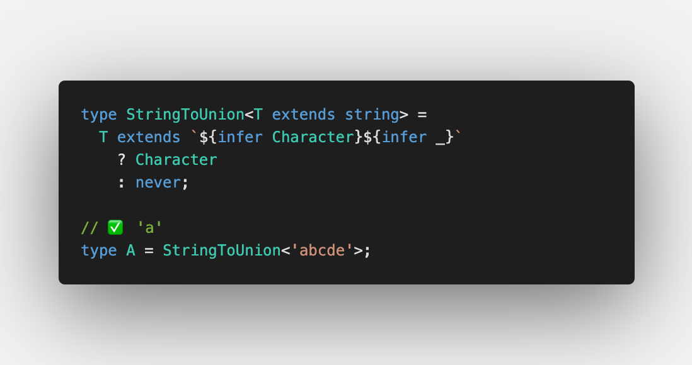
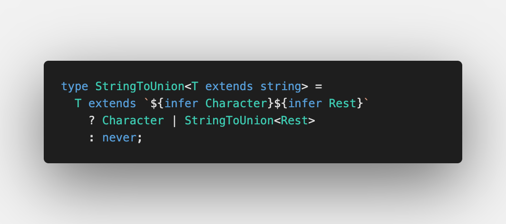
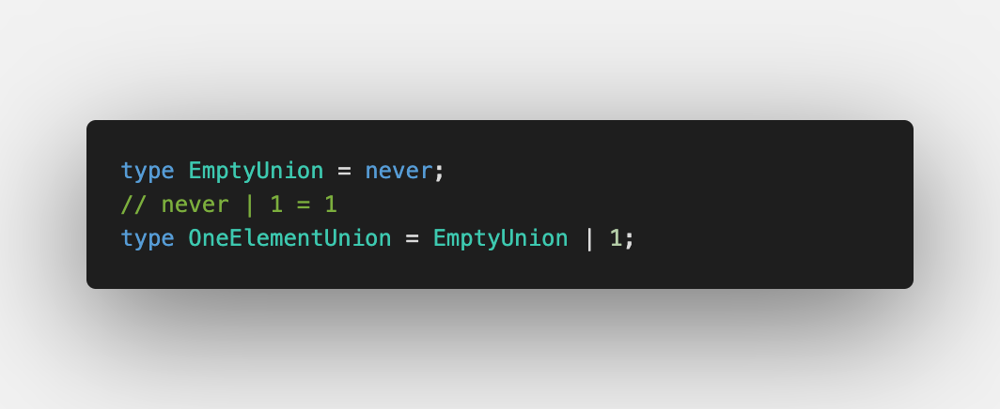

Today we discuss [StringToUnion](https://github.com/type-challenges/type-challenges/blob/master/questions/531-medium-string-to-union/README.md)

Type transformations are useful for different types of tasks.

We already discussed:

- Tuple to Object in [Making object out of tuple](/2021-04-07-making-object-out-of-tuple/)
- Tuple to Union in [Making union out of tuple](/2021-04-27-making-union-out-of-tuple/)

Let's go 🚀

## Iteration over a string

Let's start from the first character:

We cannot extract it using indices as we get `string`. Instead let's apply [Type inference in conditional types](https://www.typescriptlang.org/docs/handbook/release-notes/typescript-2-8.html#type-inference-in-conditional-types):

## Putting characters into a union

Next step is to put other characters into a union.

As we already can get first character, let's apply it recursively:

On the final step where we have an empty string, it converts to `never`

If we deal with a union type, `never` is the type when we have no elements in it. But if we put any element in it, `never` will be removed from it:

That's it 💫

Don't forget to check the final solution on Playground – https://tsplay.dev/N7bXqw

Have a wonderful weekend ☀️
