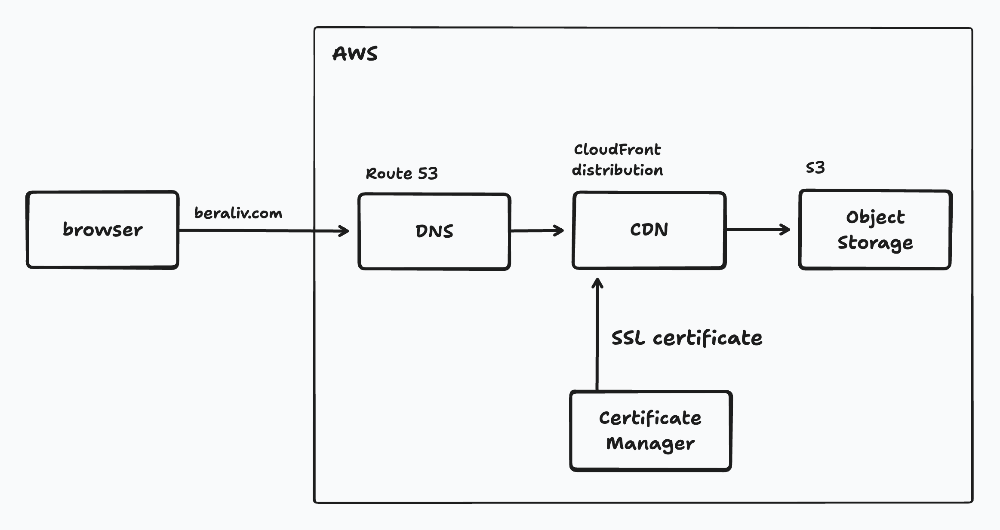

# beraliv.dev

A personal website uniting all my projects in one place

## Quick start

```bash
pnpm install
pnpm --filter id dev
```

Open [http://localhost:3000](http://localhost:3000) with your browser to see the result.

## AWS architecture



## Technologies

- [AWS](https://aws.amazon.com/) - infrastructure
- [Vite](https://vitejs.dev/) - building the project
